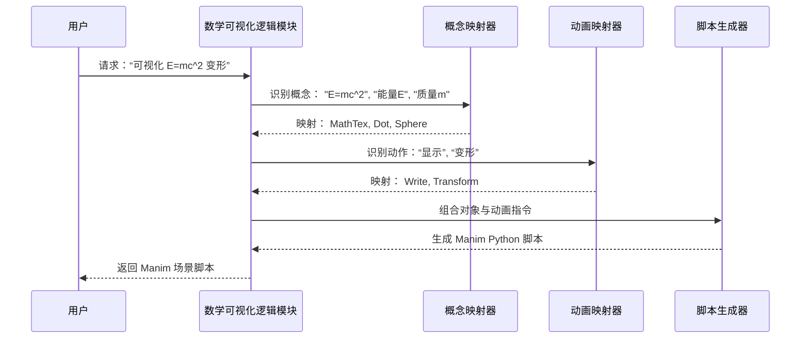

# Chapter 1: 数学可视化逻辑 (Mathematical Visualization Logic)


欢迎来到 `Math-To-Manim` 的世界！这是一个旨在将抽象的数学和物理概念转化为引人入胜的 Manim 动画的项目。在本教程的第一章，我们将探讨这个项目的核心基石：**数学可视化逻辑**。

## 为什么需要数学可视化逻辑？

想象一下，你想向他人解释爱因斯坦著名的质能方程 $E=mc^2$。这个公式本身非常简洁，但它蕴含着深刻的物理意义：能量和质量是等价的，可以相互转换。仅仅展示这个公式可能不足以传达其全部含义。

你可能希望创建一个动画：
1.  首先，优雅地展示公式 $E=mc^2$。
2.  然后，用视觉元素表示“能量”（比如一个发光的点）。
3.  接着，将这个“能量”点变形为一个代表“质量”的球体。
4.  最后，可能还想加入一些解释性文字或旁白。

这就是数学可视化逻辑要解决的问题。我们需要一种方法，将抽象的数学概念（如 $E=mc^2$、能量、质量、转换）和我们想要表达的叙事流程，系统地“翻译”成 Manim 能够理解的视觉元素（如 `MathTex` 公式、`Dot` 点、`Sphere` 球体）和动画指令（如 `Write` 书写、`Transform` 变形、`FadeIn` 淡入）。

**`Math-To-Manim` 的核心目标就是建立这种从抽象概念到具体 Manim 代码的桥梁。** 数学可视化逻辑就是这座桥梁的设计蓝图。

## 核心概念：从抽象到具象的映射

数学可视化逻辑的核心思想是将抽象的知识转化为具体的视觉表现。这就像一位插画师或电影导演：

1.  **理解概念 (Understanding):** 首先，需要深入理解你想要可视化的数学或物理概念。比如，量子电动力学中的粒子相互作用，期权定价中的波动率微笑，或者神经网络中的注意力机制。
2.  **构思视觉隐喻 (Visual Metaphor):** 为抽象概念选择合适的视觉表示。
    *   数学公式 ($E=mc^2$) -> Manim 的 `MathTex` 或 `Tex` 对象。
    *   粒子 (电子、光子) -> `Dot` (点) 或 `Circle` (圆)。
    *   场 (电磁场) -> `VectorField` (向量场) 或 `Surface` (曲面)。
    *   数据分布或函数 -> `Axes` (坐标轴) 加上 `plot` (绘图)。
    *   过程或步骤 -> 可能是 `Arrow` (箭头) 连接的不同元素，或者是按顺序出现的文本 `Text`。
3.  **设计动态效果 (Animation Design):** 思考如何通过动画来展示概念之间的关系或演变过程。
    *   展示一个新元素 -> `Create` (创建)、`Write` (书写)、`FadeIn` (淡入)。
    *   将一个概念转变为另一个 -> `Transform` (变形)。
    *   移动元素 -> `MoveAlongPath` (沿路径移动)、`.animate.shift()` (平移)。
    *   强调某个部分 -> `Indicate` (指示)、`Flash` (闪烁)。
    *   移除元素 -> `FadeOut` (淡出)。

**打个比方：**

*   **抽象概念** 就像是剧本里的文字描述（“主角感到悲伤”）。
*   **数学可视化逻辑** 就像是导演的分镜设计和拍摄计划。
*   **Manim 对象** 就像是演员、道具、场景。
*   **Manim 动画** 就像是演员的表演、镜头的移动。

这个“翻译”过程并不总是直接的，它需要创造力，并且可能需要结合 [AI 交互与生成 (AI Interaction & Generation)](02_ai_交互与生成__ai_interaction___generation__.md) 来辅助构思和实现。

## 如何应用：可视化 $E=mc^2$

让我们回到 $E=mc^2$ 的例子，看看如何应用这个逻辑。

**1. 目标：**
   - 显示公式 $E=mc^2$。
   - 视觉化地展示能量（E）可以转化为质量（m）。

**2. 映射：**
   - **概念 -> 对象:**
     - 公式 $E=mc^2$ -> `MathTex("E=mc^2")`
     - 能量 (E) -> `Dot(color=YELLOW)` (一个黄色的点)
     - 质量 (m) -> `Sphere(radius=0.5, color=BLUE)` (一个蓝色的球体)
   - **动作 -> 动画:**
     - 显示公式 -> `Write`
     - 能量出现 -> `FadeIn`
     - 能量转化为质量 -> `Transform`

**3. Manim 脚本（简化示例）：**

这是一个非常简化的 Manim [场景 (Manim Scene)](03_manim_场景__manim_scene__.md) 代码片段，展示了这个逻辑：

```python
# 导入 Manim 库 (基础)
from manim import Scene, MathTex, Dot, Sphere, Write, FadeIn, Transform, YELLOW, BLUE

# 定义一个 Manim 场景类
class VisualizeEmc2(Scene):
    def construct(self):
        # 1. 显示公式
        formula = MathTex("E=mc^2").scale(2) # 创建公式对象，放大两倍
        self.play(Write(formula)) # 使用 Write 动画显示公式
        self.wait(1) # 暂停 1 秒

        # 将公式移到角落
        self.play(formula.animate.to_corner(UL).scale(0.5)) # 移动并缩小

        # 2. 创建能量和质量的视觉表示
        energy_dot = Dot(color=YELLOW).scale(2) # 黄色点代表能量
        mass_sphere = Sphere(radius=0.5, color=BLUE) # 蓝色球代表质量
        mass_sphere.move_to(energy_dot.get_center()) # 让球体出现在点的位置

        # 3. 显示能量并转化为质量
        self.play(FadeIn(energy_dot)) # 淡入能量点
        self.wait(1)
        self.play(Transform(energy_dot, mass_sphere)) # 将点变形为球
        self.wait(2) # 暂停观看

        # ... 后续可以添加更多解释或动画 ...
```

**代码解释：**

*   `MathTex("E=mc^2")`: 将 LaTeX 字符串 `"E=mc^2"` 映射为 Manim 的数学公式对象。
*   `Dot(color=YELLOW)` 和 `Sphere(...)`: 将抽象的“能量”和“质量”映射为具体的 Manim 形状对象。
*   `self.play(Write(formula))`: 将“显示公式”这个动作映射为 Manim 的 `Write` 动画。
*   `self.play(Transform(energy_dot, mass_sphere))`: 将“能量转化为质量”这个过程映射为 Manim 的 `Transform` 动画，它会将第一个对象平滑地变成第二个对象。

这个简单的例子展示了数学可视化逻辑的核心：**理解概念 -> 选择视觉表示 -> 设计动态效果 -> 编写 Manim 代码**。

## 内部实现：逻辑如何运作？

`Math-To-Manim` 项目旨在部分自动化这个过程，尤其是在 [AI 交互与生成 (AI Interaction & Generation)](02_ai_交互与生成__ai_interaction___generation__.md) 的帮助下。但其底层逻辑遵循相似的步骤。

**非代码流程 walkthrough (当用户输入请求时)：**

1.  **输入解析：** 系统接收用户的请求，可能是自然语言（“可视化光合作用过程”）或更结构化的描述。
2.  **概念识别：** 逻辑模块（可能借助 AI）识别出核心的数学/物理概念（光合作用、反应物、生成物、能量转换）。
3.  **对象映射：** 查询一个“知识库”或使用启发式规则/AI，为这些概念选择合适的 Manim 对象（`Tex` 表示化学式，`Sphere` 表示分子，`Arrow` 表示反应方向，`Flash` 表示能量）。
4.  **动画映射：** 根据请求中的动作词（“显示”、“转化”、“移动”、“强调”）或预设的叙事模板，选择对应的 Manim 动画（`Write`, `Transform`, `animate.shift`, `Indicate`）。
5.  **脚本生成：** 将选定的 Manim 对象和动画组合起来，按照逻辑顺序生成一个初步的 [动画编排脚本 (Animation Orchestration Script)](05_动画编排脚本__animation_orchestration_script__.md)。
6.  **（可选）优化与调整：** 用户或 AI 进一步调整脚本，优化视觉效果、时间节奏和布局。

**序列图示例：**



**内部代码示例 (概念性):**

虽然 `Math-To-Manim` 的完整实现会更复杂，但我们可以看看一些来自提供的代码片段的例子，它们体现了这种映射逻辑。

*   **来自 `AlexNet.py`:**

```python
# 概念：神经网络结构抽象表示
# 映射：使用线条 (Line) 和圆角矩形 (RoundedRectangle)
lines = VGroup(*[Line(...) for i in range(12)]).set_color(BLUE)
blocks = VGroup(*[RoundedRectangle(...) for i in range(6)])

# 概念：显示 "AlexNet (2012)" 文字
# 映射：使用 Tex 对象
alexnet_text = VGroup(
    Tex("AlexNet", color=WHITE).scale(2),
    Tex("(2012)", color=GRAY_B).scale(1.2)
).arrange(DOWN, aligned_edge=LEFT)

# 动作：淡入显示
# 映射：使用 FadeIn 动画
self.play(FadeIn(alexnet_text, shift=UP), run_time=1.5)
```

*   **来自 `Hunyuan-T1QED.py` (量子电动力学):**

```python
# 概念：费曼图中的电子路径
# 映射：使用贝塞尔曲线 (CubicBezier)
electron1 = CubicBezier(..., color=BLUE)

# 概念：公式 L_QED (拉格朗日量)
# 映射：使用 MathTex，并对不同部分着色
lagrangian = MathTex(
    r"\mathcal{L}_{\text{QED}} =",
    r"\bar{\psi}", # 费米子场
    r"(i \gamma^\mu D_\mu - m)\psi", # 狄拉克项
    r"- \tfrac{1}{4}F_{\mu\nu}F^{\mu\nu}", # 电磁场项
    color=[ORANGE, GREEN, TEAL, GOLD] # 不同颜色代表不同概念
).scale(0.5)

# 动作：写入公式
# 映射：使用 Write 动画
self.play(Write(lagrangian), run_time=3)
```

这些例子都展示了如何将特定的领域概念（神经网络层、粒子路径、物理公式）映射到具体的 Manim `Mobject`（视觉对象），以及如何将想要表达的动作（显示、变形、连接）映射到 Manim 的 `Animation`（动画）。`Math-To-Manim` 的目标就是让这个映射过程更加智能和高效。

## 总结

本章我们初步了解了 `Math-To-Manim` 项目背后的核心思想——**数学可视化逻辑**。它的本质是将抽象的数学或物理概念，通过一系列映射规则，“翻译”成 Manim 可以理解和执行的视觉对象与动画指令。这就像是为复杂的科学故事编写分镜脚本，让抽象的知识变得生动直观。

我们通过 $E=mc^2$ 的简单例子，以及更复杂的代码片段，看到了这种映射关系的实际应用。理解了这种逻辑，就掌握了使用 `Math-To-Manim`（以及 Manim 本身）进行科学可视化的基础。

在下一章，我们将探讨 [AI 交互与生成 (AI Interaction & Generation)](02_ai_交互与生成__ai_interaction___generation__.md)，看看如何利用人工智能来辅助甚至自动化这个从抽象概念到具体动画的“翻译”过程，让创作过程更加便捷和强大。

