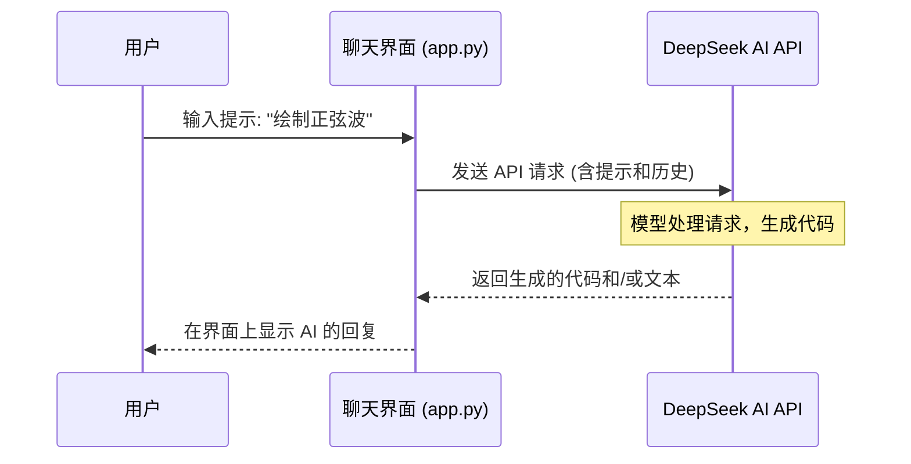

# Chapter 2: AI 交互与生成 (AI Interaction & Generation)


在上一章 [数学可视化逻辑 (Mathematical Visualization Logic)](01_数学可视化逻辑__mathematical_visualization_logic__.md) 中，我们探讨了如何将抽象的数学概念映射为具体的 Manim 视觉元素和动画。我们学习了思考过程：理解概念 -> 选择视觉隐喻 -> 设计动态效果 -> 编写代码。

然而，正如你可能已经体会到的，将复杂的想法，尤其是涉及精细数学公式或多步骤物理过程的想法，手动“翻译”成精确的 Manim Python 代码，可能既耗时又具有挑战性。特别是对于初学者来说，记住所有 Manim 对象、动画和配置选项可能会让人望而生畏。

这正是本章要介绍的核心概念——**AI 交互与生成**——发挥作用的地方。`Math-To-Manim` 项目巧妙地利用了人工智能（AI）模型，来充当你的智能助手，帮助你更轻松地将想法转化为 Manim 动画代码。

## 为什么需要 AI 辅助？

想象一下，你想创建一个简单的动画：绘制函数 $f(x) = \sin(x)$ 从 $x=0$ 到 $x=2\pi$ 的图像。

根据第一章的逻辑，你需要：
1.  **理解概念：** 正弦函数及其在一个周期内的形状。
2.  **视觉隐喻：** 需要一个坐标系 (`Axes`) 和一条曲线 (`plot`)。
3.  **动态效果：** 可能希望曲线逐渐绘制出来 (`Create` 或 `Write`)。
4.  **编写代码：** 使用 Manim 的 `Axes` 类创建坐标轴，使用 `axes.plot()` 方法绘制函数，并使用 `self.play()` 来播放动画。

虽然这个例子相对简单，但对于更复杂的场景，例如 [Readme.md](../Readme.md) 中提到的量子电动力学（QED）可视化，手动编写代码会变得极其复杂。你需要精确控制大量对象、复杂的数学公式（使用 LaTeX 格式）和复杂的动画序列。

**`Math-To-Manim` 引入 AI 的目的就是：** 让你能够用更自然的方式（比如自然语言或详细的描述）表达你的可视化意图，然后让 AI 帮助你生成初步的，甚至是相当完善的 Manim 代码。这就像拥有一个既懂数学又懂 Manim 编程的助手。

## 核心概念

让我们分解一下 `Math-To-Manim` 中 AI 交互的关键组成部分。

### 1. AI 作为助手 (AI as an Assistant)

项目的核心是使用强大的 AI 模型，例如项目提到的 DeepSeek。你可以将这些 AI 模型想象成一个非常聪明的助手。它们接受过海量文本和代码的训练，能够理解你的指令（“提示词”）并根据这些指令生成文本或代码。

在这个项目中，AI 的主要任务是：
*   **理解你的可视化请求：** 解析你想要展示的数学或物理概念。
*   **生成 Manim 代码：** 根据你的请求，编写相应的 Python 代码来创建 [Manim 场景 (Manim Scene)](03_manim_场景__manim_scene__.md)。
*   **提供解释（可选）：** 有时 AI 还能解释它生成的代码或相关的数学概念（例如项目提到的生成 LaTeX 学习笔记）。

### 2. 交互界面 (`app.py`)

为了方便地与 AI 助手“对话”，项目提供了一个简单的聊天界面，由 `app.py` 文件实现。当你运行这个文件时（通常使用 `python app.py` 命令），它会启动一个基于 Web 的聊天窗口（使用了 Gradio 库）。

在这个聊天窗口里，你可以像使用 ChatGPT 或其他聊天机器人一样，直接输入你的请求，AI 模型会处理你的输入并给出回复，回复中通常会包含建议的 Manim 代码片段。

**`app.py` 的作用：**
*   提供一个用户友好的界面来与 AI 交互。
*   处理用户输入的消息。
*   将消息发送给配置好的 AI 模型（如 DeepSeek）。
*   接收 AI 的回复并将其显示给用户。
*   通常还会保留对话历史，让 AI 了解上下文。

```python
# app.py (简化示意)
import gradio as gr
from openai import OpenAI # 用于连接 DeepSeek API

# ... (省略 API Key 加载和配置) ...

client = OpenAI(api_key="YOUR_API_KEY", base_url="https://api.deepseek.com")

def chat_with_deepseek(message, history):
    # 1. 格式化历史记录和新消息
    messages = format_history(history) # 辅助函数 (未显示)
    messages.append({"role": "user", "content": message})
    
    # 2. 调用 DeepSeek API
    try:
        response = client.chat.completions.create(
            model="deepseek-reasoner", # 指定使用的 AI 模型
            messages=messages
        )
        # 3. 获取并格式化回复
        reply = response.choices[0].message.content
        return format_latex(reply) # 辅助函数，美化 LaTeX 输出 (未显示)
    except Exception as e:
        return f"错误: {str(e)}"

# 4. 创建 Gradio 聊天界面
iface = gr.ChatInterface(
    chat_with_deepseek,
    title="DeepSeek 聊天助手",
    description="与 DeepSeek AI 对话生成 Manim 代码或获取解释。"
)

if __name__ == "__main__":
    iface.launch() # 启动聊天界面
```

**代码解释 (简化版 `app.py`)：**
1.  `chat_with_deepseek` 函数是核心，它接收用户的新消息 (`message`) 和之前的对话历史 (`history`)。
2.  它将这些信息打包，通过 `client.chat.completions.create` 发送给 DeepSeek AI。
3.  它接收 AI 的回复 (`response`) 并返回给界面显示。
4.  `gr.ChatInterface` 创建了我们看到的聊天窗口。
5.  `iface.launch()` 启动这个 Web 应用。

### 3. 提示词工程 (Prompt Engineering)

与 AI 助手有效沟通的关键在于**提示词 (Prompt)**——你给 AI 的指令。`Readme.md` 文件特别强调了这一点：

> Your prompts need extreme detail in order for this to work. ... you have to prompt in Latex.

这意味着，要想让 AI 生成高质量、符合预期的复杂 Manim 代码，你需要提供非常详细和清晰的指令。这就像给一位画家非常具体的指示（“我想要一幅日落景象，左边有一棵孤树，天上有两朵卷云，色调要温暖...”）而不是模糊的要求（“画个风景”）。

对于 `Math-To-Manim` 来说，一个好的提示词可能包括：
*   **明确的目标：** 你想可视化什么概念？（例如，“展示高斯分布的概率密度函数”）
*   **关键元素：** 需要哪些视觉对象？（坐标轴、曲线、标签、公式...）
*   **动画步骤：** 对象应该如何出现、移动或变换？（淡入坐标轴，然后绘制曲线，最后显示公式）
*   **数学细节 (使用 LaTeX)：** 对于公式或数学符号，直接在提示词中使用 LaTeX 语法（例如，`$\mathcal{L}_{\text{QED}} = ...$`）。AI 对 LaTeX 有很好的理解，这有助于精确生成 `MathTex` 对象。

`Readme.md` 中提供了一个非常详细的 LaTeX 提示词示例，用于生成复杂的量子场论动画。虽然那个例子很长，但它展示了为了获得精确结果所需的细节程度。

**打个比方：**
*   **简单的提示词：** “画个圆。” -> AI 可能只生成一个基本的圆。
*   **详细的提示词：** “创建一个 Manim 场景，首先显示标题‘圆的演示’，然后慢慢绘制一个半径为 2、颜色为蓝色、线条粗细为 8 的圆，圆心在屏幕中央。” -> AI 更有可能生成满足所有这些要求的代码。

## 如何使用 AI 生成动画？

让我们回到之前绘制正弦波的例子，看看如何利用 AI 助手。

**1. 启动交互界面:**
   在你的终端（命令行）中，进入项目目录，并运行：
   ```bash
   python app.py
   ```
   这会启动一个本地 Web 服务器，并通常会提供一个网址（如 `http://127.0.0.1:7860`）。在浏览器中打开这个网址，你就能看到聊天界面。

**2. 输入提示词:**
   在聊天框中，输入你的请求。对于正弦波，你可以尝试这样的提示词：

   ```
   请帮我创建一个 Manim 动画场景 (Scene)。
   1. 创建一个坐标轴 (Axes)，x 轴范围从 0 到 2*pi，y 轴范围从 -1.5 到 1.5。
   2. 在这个坐标轴上绘制函数 f(x) = sin(x) 的图像，使用蓝色。
   3. 使用 Create 动画效果来显示坐标轴，然后使用 Write 动画效果来绘制正弦曲线。
   ```

**3. 获取 AI 生成的代码:**
   AI 模型（如 DeepSeek）会处理你的请求，并尝试生成相应的 Manim Python 代码。它可能会返回类似这样的内容（这是一个简化的理想输出）：

   ```python
   # AI 可能生成的代码 (简化示例)
   from manim import *
   import numpy as np

   class SineWaveScene(Scene):
       def construct(self):
           # 1. 创建坐标轴
           axes = Axes(
               x_range=[0, 2 * PI, PI / 2], # x 轴范围和步长
               y_range=[-1.5, 1.5, 1],     # y 轴范围和步长
               axis_config={"include_numbers": True} # 显示刻度数字
           )
           
           # 2. 定义要绘制的函数
           sine_graph = axes.plot(
               lambda x: np.sin(x),       # 函数本身
               color=BLUE                 # 曲线颜色
           )
           
           # 3. 动画
           self.play(Create(axes))         # 创建坐标轴动画
           self.play(Write(sine_graph))    # 绘制曲线动画
           self.wait(1)                    # 暂停 1 秒
   ```

**代码解释 (AI 生成的示例)：**
*   它导入了 `manim` 库和 `numpy` (通常用于数学函数)。
*   创建了一个名为 `SineWaveScene` 的 [Manim 场景 (Manim Scene)](03_manim_场景__manim_scene__.md)。
*   `Axes(...)` 创建了坐标系，指定了 x 和 y 的范围。
*   `axes.plot(lambda x: np.sin(x), ...)` 使用 `lambda` 函数定义了正弦函数，并在坐标轴上绘制了它。
*   `self.play(Create(axes))` 和 `self.play(Write(sine_graph))` 执行了动画。

**4. 使用和调整代码:**
   你可以将 AI 生成的这段代码复制到一个 `.py` 文件（例如 `my_sine_wave.py`），然后使用 Manim 命令来渲染它：
   ```bash
   python -m manim -pql my_sine_wave.py SineWaveScene
   ```
   ( `-pql` 表示预览低质量版本)

   AI 生成的代码可能并不完美。有时你需要根据自己的具体需求进行修改和调整，比如改变颜色、范围、动画速度，或者修复 AI 可能犯的小错误。这就是为什么理解第一章的 [数学可视化逻辑 (Mathematical Visualization Logic)](01_数学可视化逻辑__mathematical_visualization_logic__.md) 仍然很重要。

**对于更复杂的场景：**
如果你的目标是像 `Readme.md` 里描述的那样复杂的动画（如 QED），你就需要提供极其详细的、可能包含大量 LaTeX 的提示词。例如，提示词里可能会有这样的片段：

```latex
... 
显示拉格朗日密度 L_QED:
$$ \mathcal{L}_{\text{QED}} = \bar{\psi}(i \gamma^\mu D_\mu - m)\psi - \tfrac{1}{4}F_{\mu\nu}F^{\mu\nu} $$
将这个公式投影到一个半透明平面上，每个符号用不同颜色编码：
$\psi$ 用橙色， $D_\mu$ 用绿色， $\gamma^\mu$ 用亮青色， $F_{\mu\nu}$ 用金色...
...
```
这种程度的细节有助于 AI 精确生成包含 `MathTex` 对象并正确设置颜色和布局的代码。

## 内部实现：AI 交互是如何工作的？

让我们简单看看当你通过 `app.py` 与 AI 交互时，幕后发生了什么。

**非代码流程 walkthrough:**

1.  **用户输入:** 你在 `app.py` 提供的聊天界面中输入你的提示词（例如，“绘制正弦波”）。
2.  **发送请求:** `app.py` 获取你的消息，可能还会附带上之前的对话历史（这样 AI 就有上下文），然后将这些信息打包成一个 API 请求。
3.  **调用 AI API:** 这个请求被发送到 AI 提供商的服务器（例如 DeepSeek API 的 `https://api.deepseek.com` 地址）。
4.  **AI 处理:** DeepSeek AI 模型接收到请求，分析你的提示词和历史记录，理解你的意图。
5.  **生成回复:** AI 模型生成回复，这通常包括解释性的文字和/或它认为符合你要求的 Manim Python 代码。
6.  **返回响应:** AI 服务器将生成的回复发送回 `app.py`。
7.  **显示结果:** `app.py` 接收到回复，可能做一些格式化（比如美化 LaTeX），然后将其显示在聊天界面中给你看。

**序列图示例:**

这个简单的图表展示了基本流程：



**关键代码片段 (`app.py`):**

`app.py` 中的 `chat_with_deepseek` 函数是这个流程的核心实现：

```python
# app.py (部分代码)
from openai import OpenAI # 使用 OpenAI 库连接 DeepSeek

# ... (加载 API Key) ...
client = OpenAI(api_key=os.getenv("DEEPSEEK_API_KEY"), base_url="https://api.deepseek.com")

def chat_with_deepseek(message, history):
    # 将 Gradio 的历史格式转换为 API 需要的列表格式
    messages = []
    for human, assistant in history:
        messages.append({"role": "user", "content": human})
        if assistant: # 确保只添加有效的助手回复
            messages.append({"role": "assistant", "content": assistant})
    messages.append({"role": "user", "content": message}) # 添加当前用户消息
    
    try:
        # 调用 DeepSeek API 的 chat completion 端点
        response = client.chat.completions.create(
            model="deepseek-reasoner", # 指定模型
            messages=messages         # 传入格式化后的对话历史
        )
        
        # 提取 AI 的回复内容
        reply = response.choices[0].message.content
        # (省略了 reasoning_content 和 format_latex 的处理)
        return reply 
    except Exception as e:
        return f"调用 API 时出错: {str(e)}"

# ... (Gradio 界面设置) ...
```

**代码解释:**
*   函数首先将聊天历史 (`history`) 转换成 DeepSeek API 理解的 `messages` 列表格式，每个消息都有一个 `role` (`user` 或 `assistant`) 和 `content`。
*   然后，它使用 `client.chat.completions.create()` 将这个 `messages` 列表发送给指定的 `model` (`deepseek-reasoner`)。
*   `response.choices[0].message.content` 从 API 的响应中提取出主要的文本回复。
*   最后返回这个回复，或者在出错时返回错误信息。

**关于 LaTeX 提示词:**
`Readme.md` 强调使用详细的 LaTeX 提示词。这意味着用户在聊天界面输入的 `message` 内容可以包含大量的 LaTeX 语法。`app.py` 本身并不解析 LaTeX，它只是将其作为普通文本传递给 DeepSeek AI。DeepSeek AI 模型经过训练，能够理解 LaTeX 语法，并将其用于生成正确的 `MathTex` 或 `Tex` Manim 对象。这就是为什么详细的 LaTeX 提示能产生更好结果的原因——它为 AI 提供了最精确的数学表达。

## 总结

本章我们探讨了 `Math-To-Manim` 项目如何利用 **AI 交互与生成** 来简化数学可视化的过程。我们了解到：

*   AI（如 DeepSeek）可以充当智能助手，根据你的指令生成 Manim 代码。
*   `app.py` 提供了一个方便的聊天界面，让你与 AI 对话。
*   **提示词工程**，特别是使用详细的指令和 LaTeX 语法，是获得高质量结果的关键。

通过结合第一章的 [数学可视化逻辑 (Mathematical Visualization Logic)](01_数学可视化逻辑__mathematical_visualization_logic__.md) 和本章介绍的 AI 辅助，`Math-To-Manim` 旨在让创建复杂、精美的数学动画变得更加容易。AI 可以处理繁琐的编码细节，让你更专注于创意和概念本身。

在下一章中，我们将深入探讨 AI 生成代码的核心目标：[Manim 场景 (Manim Scene)](03_manim_场景__manim_scene__.md)。我们将学习 Manim 场景的基本结构，以及如何组织和运行 AI 生成的（或你手动编写的）动画代码。

