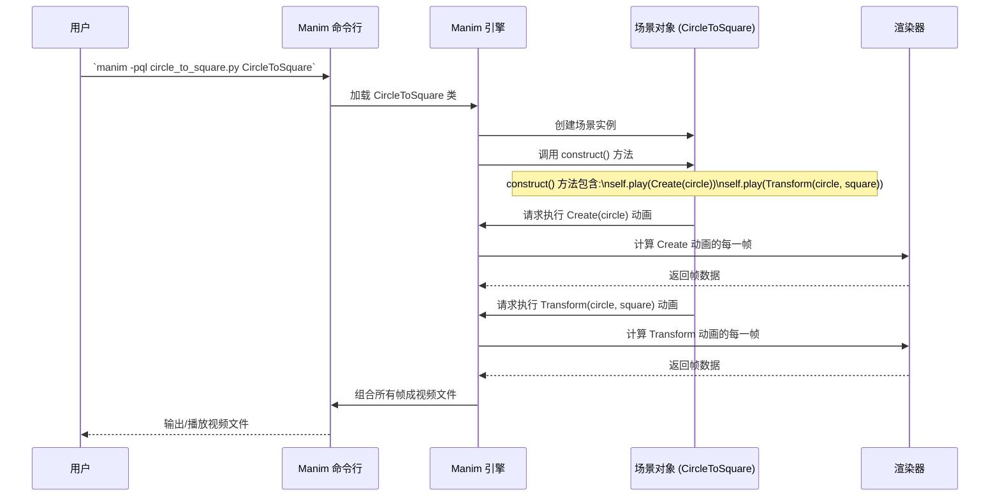

# Chapter 3: Manim 场景 (Manim Scene)


在上一章 [AI 交互与生成 (AI Interaction & Generation)](02_ai_交互与生成__ai_interaction___generation__.md) 中，我们探讨了如何利用 AI 来辅助我们生成 Manim 动画代码。AI 可以根据我们的描述，输出 Python 代码片段。那么，这些代码片段最终构成了什么呢？它们通常定义了一个或多个 **Manim 场景 (Manim Scene)**。

想象一下，你想制作一部关于几何形状变化的短片。也许你想展示一个圆圈如何平滑地变成一个正方形。在 Manim 中，这部“短片”或者说这个“片段”，就是在一个“场景”中制作完成的。

本章，我们将深入了解 Manim 场景这个核心概念。你可以把它想象成电影中的一个片段、舞台上的一幕戏，或者一个供你挥洒创意的数字画布。它是所有动画的基础构建块。

## 什么是 Manim 场景？

Manim 场景本质上是一个 Python 类 (Class)，它继承自 Manim 库提供的基类（通常是 `Scene` 或 `ThreeDScene`）。这个类就像是你的动画项目的蓝图或剧本。

在这个类里面，最重要的部分是一个叫做 `construct` 的方法（函数）。这个 `construct` 方法就是你的“舞台”，你将在这里：

1.  **添加演员 (Mobjects):** 放入各种视觉元素，比如文字 (`Text`)、数学公式 (`MathTex`)、形状 (`Circle`, `Square`)、坐标轴 (`Axes`) 等等。这些视觉元素在 Manim 中统称为 `Mobject` (Mathematical Object 的缩写）。
2.  **编写剧本 (Animations):** 定义这些“演员”如何登场 (`Create`, `FadeIn`)、如何移动 (`animate.shift`)、如何变形 (`Transform`)、如何退场 (`FadeOut`)。这些动作在 Manim 中称为“动画” (Animation)。
3.  **控制节奏 (Timing):** 使用 `self.play(...)` 来播放动画，并使用 `self.wait(...)` 来暂停，控制动画的节奏。

**打个比方：**

*   你的 `.py` 文件就像是一个剧院。
*   每个 `Scene` 类就是剧院里的一个舞台。
*   `construct` 方法就是这个舞台上正在上演的某一幕戏的剧本。
*   `Mobject` (如 `Circle`, `Tex`) 是你的演员和道具。
*   `Animation` (如 `Create`, `Transform`) 是演员的动作和表演。
*   `self.play()` 就是导演喊“Action!”，让表演开始。

通常，一个 `.py` 文件可以定义多个场景类，每个类代表一个独立的动画片段。当你运行 Manim 命令时，你需要指定你想要渲染（制作成视频）的是哪一个场景。

## 使用场景：从圆到方的变形记

让我们回到最初的例子：将一个圆变成一个正方形。看看如何在一个 Manim 场景中实现它。

**1. 创建 Python 文件:**
   首先，创建一个 Python 文件，比如 `circle_to_square.py`。

**2. 编写场景代码:**
   在文件中输入以下代码：

   ```python
   # 导入 Manim 库中我们需要的基础组件
   from manim import Scene, Circle, Square, Create, Transform, BLUE, PINK

   # 定义一个场景类，它继承自 Manim 的 Scene 类
   class CircleToSquare(Scene):
       # 定义 construct 方法，这是动画的主体
       def construct(self):
           # 1. 创建一个蓝色的圆
           my_circle = Circle(color=BLUE)

           # 2. 创建一个粉色的正方形
           my_square = Square(color=PINK)

           # 3. 播放动画：创建圆并显示出来
           self.play(Create(my_circle)) # 播放“创建”动画

           # 4. 暂停 1 秒钟
           self.wait(1)

           # 5. 播放动画：将圆平滑地变成正方形
           self.play(Transform(my_circle, my_square)) # 播放“变形”动画

           # 6. 再暂停 1 秒钟
           self.wait(1)

           # construct 方法结束，这一幕戏就演完了
   ```

**代码解释:**

*   `from manim import ...`: 我们从 `manim` 库导入了必要的构建块：`Scene` (场景基类)，`Circle` 和 `Square` (我们的“演员”形状)，`Create` 和 `Transform` (演员的“动作”动画)，以及颜色 `BLUE` 和 `PINK`。
*   `class CircleToSquare(Scene):`: 我们定义了一个名为 `CircleToSquare` 的新类，它继承了 `Scene` 的所有基本功能。
*   `def construct(self):`: 这是场景的核心方法。Manim 会自动调用这个方法来构建动画。`self` 代表这个场景对象本身。
*   `my_circle = Circle(...)`: 创建一个圆对象，并设置颜色为蓝色。
*   `my_square = Square(...)`: 创建一个正方形对象，设置颜色为粉色。
*   `self.play(Create(my_circle))`: `self.play` 是执行动画的命令。`Create(my_circle)` 是一个动画指令，表示“创建 `my_circle` 这个对象并显示出来”。
*   `self.wait(1)`: 让动画暂停 1 秒。
*   `self.play(Transform(my_circle, my_square))`: 播放 `Transform` 动画，它会将第一个对象 (`my_circle`) 平滑地转变成第二个对象 (`my_square`)。注意，变形后，原来的 `my_circle` 对象在屏幕上就变成了 `my_square` 的样子。

**3. 渲染场景:**
   打开你的终端（命令行），导航到保存 `circle_to_square.py` 文件的目录，然后运行 Manim 命令：

   ```bash
   python -m manim -pql circle_to_square.py CircleToSquare
   ```

   *   `python -m manim`: 这是运行 Manim 的标准方式。
   *   `-pql`: 参数 `-p` 表示预览 (preview)，`-ql` 表示低质量 (quality low)。这会快速生成一个低分辨率的视频文件并在播放器中打开它。如果你想生成高质量视频，可以使用 `-pqh` (高质量) 或查阅 Manim 文档了解更多选项。
   *   `circle_to_square.py`: 你的 Python 文件名。
   *   `CircleToSquare`: 你想要渲染的场景类的名称。

执行命令后，Manim 会处理你的代码，生成一系列帧，并将它们合成为一个视频文件（通常是 `.mp4` 格式），然后自动播放。你将看到一个蓝色的圆出现，暂停片刻，然后平滑地变成一个粉色的正方形。

这个简单的例子展示了 Manim 场景的核心工作流程：**定义类 -> 编写 `construct` -> 添加对象 -> 编排动画 -> 渲染**。

## 内部实现：Manim 如何运作场景？

当我们运行 `manim` 命令时，背后发生了什么？理解这个过程有助于我们更好地使用 Manim。

**非代码流程 walkthrough:**

1.  **找到场景 (Scene Discovery):** Manim 命令行工具会读取你指定的 Python 文件（例如 `circle_to_square.py`）。
2.  **定位类 (Class Location):** 它会在文件中查找你指定的场景类名（例如 `CircleToSquare`）。
3.  **创建实例 (Instantiation):** Manim 引擎会创建这个场景类的一个实例（对象）。你可以想象成 Manim 准备好了你设计的那个“舞台”。
4.  **调用构建 (Calling `construct`):** 引擎接着调用这个场景实例的 `construct` 方法。这就像是导演开始按照剧本指导演出。
5.  **执行动画 (Animation Execution):** 在 `construct` 方法中，每当遇到 `self.play(...)`，场景就会告诉 Manim 引擎：“嘿，现在要播放这个动画了（比如 `Create` 或 `Transform`）”。
6.  **计算帧 (Frame Calculation):** 对于每个动画，Manim 引擎会计算出动画期间（通常持续 1 秒，除非特别指定）每一帧画面上所有对象的状态（位置、形状、颜色等）。这就像是电影的逐帧绘制。
7.  **渲染视频 (Rendering):** 引擎将计算出的所有帧交给渲染器（通常是 Cairo 或 OpenGL），渲染器将这些帧合成为最终的视频文件。
8.  **播放/保存 (Output):** 根据你的命令行参数（如 `-pql`），Manim 可能会自动播放生成的视频，或者只是将视频文件保存在指定的输出目录中（通常是 `media/videos/...`）。

**序列图示例:**

这个图展示了从运行命令到生成视频的基本流程：



**代码层面:**

*   **`Scene` 基类:** `CircleToSquare` 类继承自 `Scene`。这个 `Scene` 基类提供了许多核心功能，最重要的就是 `self.play()` 和 `self.wait()` 方法。它还管理着场景中所有的 `Mobject`。
*   **`construct()` 方法:** 这是你与 Manim 交互的主要入口。Manim 引擎确保按顺序执行你在 `construct` 中调用的 `self.play()` 和 `self.wait()`。
*   **`Mobject`:** 像 `Circle` 和 `Square` 这样的类都继承自 `Mobject`。它们知道如何绘制自己，并且可以作为动画的目标（例如 `Transform` 的第二个参数）。
*   **`Animation`:**像 `Create` 和 `Transform` 这样的类都继承自 `Animation`。它们知道如何在一段时间内改变一个或多个 `Mobject` 的状态。`self.play()` 负责接收这些 `Animation` 对象并执行它们。

在 `Math-To-Manim` 项目提供的示例代码中（如 `AlexNet.py`, `GrokLogo.py`, `Hunyuan-T1QED.py` 等），你会看到类似的结构：

```python
# 来自 Hunyuan-T1QED.py 的简化片段
from manim import Scene, MathTex, Write # ... 其他导入 ...

# 定义一个场景类，继承自 Scene
class LagrangianDensity(Scene):
    # 定义 construct 方法
    def construct(self):
        # 创建一个数学公式对象 (Mobject)
        lagrangian = MathTex(
            r"\mathcal{L}_{\text{QED}} =", 
            # ... (LaTeX 公式内容) ...
        ).scale(0.5)
        
        # 使用 self.play 执行 Write 动画
        self.play(Write(lagrangian), run_time=3)
        
        # ... (其他动画) ...
```

这段代码再次展示了核心模式：定义一个继承自 `Scene` 的类，并在其 `construct` 方法中使用 `self.play` 来驱动 `Mobject` 的 `Animation`。

## 总结

本章我们学习了 **Manim 场景 (Manim Scene)**，它是 Manim 动画创作的基础。我们了解到：

*   每个动画都在一个继承自 `Scene`（或 `ThreeDScene`）的类中定义。
*   核心逻辑写在 `construct` 方法里。
*   在 `construct` 中，我们创建视觉元素 (`Mobject`)，并通过 `self.play()` 调用 `Animation` 来让它们动起来。
*   Manim 引擎负责解释场景代码，计算每一帧，并最终渲染成视频。

掌握了场景的概念，你就拥有了在 Manim 中创建动画的基本框架。无论是简单的形状变换，还是复杂的数学可视化（可能由 AI 辅助生成代码），都将在一个个场景中上演。

在 `Math-To-Manim` 项目中，很多复杂的动画需要三维空间来展示。因此，在下一章 [三维场景与相机 (3D Scene & Camera)](04_三维场景与相机__3d_scene___camera__.md) 中，我们将特别关注用于创建三维动画的 `ThreeDScene`，以及如何控制 3D 场景中的“摄像机”来获得最佳的观看视角。

