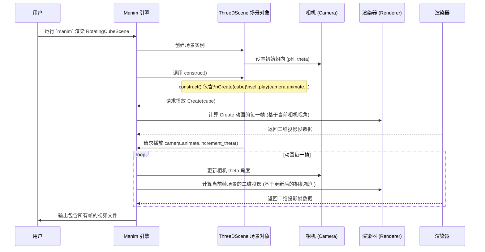

# Chapter 4: 三维场景与相机 (3D Scene & Camera)


在上一章 [Manim 场景 (Manim Scene)](03_manim_场景__manim_scene__.md) 中，我们学习了如何使用 `Scene` 类来创建二维动画。我们知道了场景就像一个画布，我们在 `construct` 方法里添加物体 (`Mobject`) 并用动画 (`Animation`) 让它们动起来。

但是，如果我们想展示的不仅仅是平面上的图形呢？比如，你想展示一个立方体的旋转，或者一个三维函数的图像，或者像 `Math-To-Manim` 项目示例中那样的复杂分子结构或物理场？这时，二维的 `Scene` 就显得力不从心了。我们需要一个能够容纳深度、能够从不同角度观察的空间。

这就是 **`ThreeDScene`** 和 **相机 (Camera)** 发挥作用的地方。本章将带你进入 Manim 的三维世界。

## 为什么要用三维场景和相机？

想象一下你想制作一个动画来展示一个立方体的各个面。在二维场景中，你最多只能看到立方体的一个投影，很难表现出它的立体感。但如果在一个三维空间里：

1.  你可以放置一个真正的三维立方体。
2.  你可以像摄影师一样，移动你的“虚拟摄像机”，围绕立方体旋转，或者靠近、远离它。
3.  通过移动摄像机，观众就能从不同角度看到立方体的不同侧面，从而理解它的三维结构。

`ThreeDScene` 提供了一个三维的舞台，而相机则决定了观众从哪个角度、以何种方式观看这个舞台上的表演。

## 核心概念

### 1. `ThreeDScene`：三维舞台

`ThreeDScene` 是 Manim 中用于创建三维动画的特殊场景类。它基本上是 [Manim 场景 (Manim Scene)](03_manim_场景__manim_scene__.md) 的扩展，增加了一个 Z 轴，从而构成了一个完整的三维坐标系 (x, y, z)。

使用 `ThreeDScene` 的方式和 `Scene` 非常相似，你仍然在 `construct` 方法中编排动画。主要的区别在于：

*   **坐标:** 你现在可以使用三维坐标 `(x, y, z)` 来放置物体。例如，`[1, 2, 3]` 表示 x=1, y=2, z=3 的位置。其中，z 轴通常表示深度，正 z 值表示物体离屏幕更近（朝向观众），负 z 值表示更远。
*   **三维物体:** 你可以使用 Manim 提供的三维物体，如 `Cube` (立方体), `Sphere` (球体), `Dot3D` (三维点), `Surface` (曲面) 等。
*   **相机控制:** `ThreeDScene` 给了你控制虚拟相机的能力。

```python
# 导入 Manim 库 (注意这里用 ThreeDScene)
from manim import ThreeDScene, Cube, BLUE, Create

# 定义一个继承自 ThreeDScene 的类
class Basic3DScene(ThreeDScene):
    def construct(self):
        # 创建一个蓝色的立方体，默认放置在三维坐标系的原点 (0,0,0)
        my_cube = Cube(side_length=2, fill_color=BLUE, fill_opacity=0.7)

        # 使用 Create 动画显示立方体
        self.play(Create(my_cube))
        self.wait(1)
```

**代码解释:**

*   我们导入 `ThreeDScene` 而不是 `Scene`。
*   我们创建了一个 `Cube` 对象，这是一个三维物体。
*   即使我们没有指定位置，它也会被放置在三维原点 `(0, 0, 0)`。

### 2. 虚拟相机 (`self.camera`)

在 `ThreeDScene` 中，有一个非常重要的对象叫做 `self.camera`。你可以把它想象成一个虚拟的摄像机，场景中最终呈现给观众的画面，完全取决于这个摄像机的位置和朝向。

默认情况下，相机位于 Z 轴的正方向（屏幕外），朝向坐标原点 `(0, 0, 0)`。但你可以改变它！

### 3. 相机朝向 (`phi`, `theta`, `gamma`)

控制相机朝向最常用的方法是设置它的**欧拉角 (Euler angles)**。对于初学者，我们主要关注两个：

*   **`phi` (俯仰角):** 控制相机上下点头的角度。想象相机装在一个水平轴上，`phi` 就是它绕这个轴旋转的角度。`0 * DEGREES` 表示水平向前看，`90 * DEGREES` 表示从正上方垂直向下看，`-90 * DEGREES` 表示从正下方垂直向上看。(`DEGREES` 是 Manim 中表示角度单位的常量)。
*   **`theta` (方位角):** 控制相机左右摇头的角度。想象相机绕着垂直轴旋转。`0 * DEGREES` 表示从 Z 轴正方向看，`-90 * DEGREES` 表示从 X 轴正方向（右侧）看。

还有一个 `gamma` (翻滚角)，控制相机绕自身视线方向的旋转，我们暂时可以忽略它。

你可以使用 `self.set_camera_orientation()` 方法来设置相机**初始**的 `phi` 和 `theta` 值。

```python
# 导入 Manim 库
from manim import ThreeDScene, Cube, BLUE, Create, DEGREES

class CameraAngleScene(ThreeDScene):
    def construct(self):
        # 设置相机的初始视角
        # phi=70度 (稍微向下看), theta=-45度 (从右前方看)
        self.set_camera_orientation(phi=70 * DEGREES, theta=-45 * DEGREES)

        my_cube = Cube(side_length=2, fill_color=BLUE, fill_opacity=0.7)
        self.play(Create(my_cube))

        # 增加一个坐标轴方便观察
        axes = ThreeDAxes()
        self.play(Create(axes))

        self.wait(2)
```

**代码解释:**

*   `self.set_camera_orientation(phi=70 * DEGREES, theta=-45 * DEGREES)` 在动画开始前就设置了相机的视角。运行这个场景，你会发现立方体和坐标轴是从一个倾斜的角度被观察的。

### 4. 相机移动 (`move_camera`)

仅仅设置初始视角还不够酷，我们更希望相机能够动起来，比如围绕物体旋转，或者推近拉远。这就是 `self.move_camera()` 方法的作用。

`self.move_camera()` 允许你在 `self.play()` 中像其他动画一样，平滑地改变相机的 `phi`, `theta`, `focal_distance` (焦距，可以理解为离目标的远近), `frame_center` (相机聚焦的点) 等属性。

**一个常用的相机动画是环绕物体旋转。**

```python
# 导入 Manim 库
from manim import ThreeDScene, Cube, BLUE, Create, DEGREES, PI

class OrbitCameraScene(ThreeDScene):
    def construct(self):
        # 设置初始视角
        self.set_camera_orientation(phi=75 * DEGREES, theta=-45 * DEGREES)

        axes = ThreeDAxes()
        my_cube = Cube(side_length=2, fill_color=BLUE, fill_opacity=0.7)

        self.play(Create(axes), Create(my_cube))
        self.wait(1)

        # 开始相机动画：围绕物体旋转
        # 我们让 theta 从 -45度 变化到 360 - 45 度 (转一整圈)
        self.play(
            self.camera.animate.set_theta(-45 * DEGREES + 2 * PI), # 2*PI 是一整圈
            run_time=5 # 动画持续 5 秒
        )
        self.wait(1)

        # 你也可以同时改变 phi 和焦距 (distance)
        self.play(
            self.camera.animate.set_phi(0 * DEGREES).set_focal_distance(10),
            run_time=3
        )
        self.wait(1)
```

**代码解释:**

*   `self.play(self.camera.animate.set_theta(...), run_time=5)`: 这里我们使用了 `.animate` 语法，告诉 Manim 我们想要动画地改变 `self.camera` 的 `theta` 属性。`2 * PI` (弧度制) 等于 360 度，所以这里是让相机水平旋转一整圈。
*   `self.play(self.camera.animate.set_phi(0 * DEGREES).set_focal_distance(10), ...)`: 这展示了你可以链式调用 `.set_...()` 方法，同时改变多个相机属性，比如将俯仰角变为 0 度（水平视角）并将相机拉远。

**注意:** Manim 还提供了 `self.begin_ambient_camera_rotation()` 和 `self.stop_ambient_camera_rotation()` 方法，可以方便地让相机持续自动旋转，这在很多示例代码（如 `Hunyuan-T1QED.py`, `3BouncingBalls/bouncing_balls.py`）中会看到。

## 使用场景：旋转的三维立方体

让我们把刚才学到的知识整合起来，完成最初的目标：创建一个展示旋转立方体的动画。

**1. 创建 Python 文件:**
   比如 `rotating_cube.py`。

**2. 编写场景代码:**

```python
# 导入 Manim 库
from manim import ThreeDScene, Cube, BLUE, Create, ThreeDAxes, DEGREES, PI

# 定义三维场景类
class RotatingCubeScene(ThreeDScene):
    def construct(self):
        # 1. 设置初始相机视角 (稍微俯视，从侧前方看)
        self.set_camera_orientation(phi=60 * DEGREES, theta=-45 * DEGREES)

        # 2. 添加坐标轴作为参考
        axes = ThreeDAxes()

        # 3. 创建一个蓝色的立方体
        cube = Cube(side_length=2, fill_color=BLUE, fill_opacity=0.7)

        # 4. 显示坐标轴和立方体
        self.play(Create(axes), Create(cube))
        self.wait(1) # 暂停 1 秒

        # 5. 让相机围绕 Y 轴 (UP 方向) 旋转 360 度
        # 这会产生物体在原地旋转的效果
        self.play(
            self.camera.animate.increment_theta(2 * PI), # 增量旋转 360 度
            run_time=6 # 动画持续 6 秒
        )
        self.wait(1)

        # 6. （可选）让相机视角抬高，并拉近距离
        self.play(
            self.camera.animate.set_phi(20 * DEGREES).set_focal_distance(6),
            run_time=3
        )
        self.wait(1)
```

**代码解释:**

*   我们首先设置了一个不错的初始视角 `phi=60 * DEGREES, theta=-45 * DEGREES`。
*   然后创建了坐标轴和立方体。
*   `self.camera.animate.increment_theta(2 * PI)` 是核心动画。我们让相机的 `theta` 角增加了 `2 * PI` (360度)。当相机围绕场景中心旋转时，看起来就像场景中的物体在旋转。
*   最后，我们还演示了如何平滑地改变 `phi` (俯仰角) 和 `focal_distance` (焦距/距离)。

**3. 渲染场景:**
   在终端中运行：
   ```bash
   python -m manim -pql rotating_cube.py RotatingCubeScene
   ```
   你会看到一个三维坐标系中的蓝色立方体，然后视角会平滑地旋转一圈，让你看到立方体的不同面，最后视角还会调整高度和远近。

## 内部实现：Manim 如何处理三维和相机？

理解 `ThreeDScene` 和相机背后的工作原理，能帮助你更好地运用它们。

**非代码流程 walkthrough:**

1.  **场景识别:** 当你运行 `manim` 命令渲染一个继承自 `ThreeDScene` 的类时，Manim 引擎知道它需要处理三维空间。
2.  **3D 设置:** 引擎建立一个三维坐标系统，并初始化一个虚拟相机对象 (`self.camera`)。
3.  **初始视角:** 如果你在 `construct` 方法开头调用了 `self.set_camera_orientation()`，相机的初始 `phi`, `theta`, `distance` 等属性会被设定。否则使用默认值。
4.  **物体放置:** 当你创建 `Cube`, `Sphere` 等三维物体时，它们会被放置在指定的三维坐标处。
5.  **动画计算:**
    *   对于普通动画（如 `Create(cube)`），Manim 计算物体在三维空间中的状态变化。
    *   对于相机动画（如 `self.play(self.camera.animate.set_theta(...))`），Manim 计算相机的位置、朝向、焦距等属性如何随时间平滑变化。
6.  **渲染投影:** **这是关键！** 对于视频的每一帧，Manim 渲染器会根据**当前时刻**相机的位置、朝向和焦距，计算出三维场景在该相机视角下的 **二维投影**。想象一下相机拍下照片，这张照片是二维的。
7.  **生成视频:** 渲染器将所有计算出的二维投影帧组合起来，生成最终的视频文件。

**序列图示例:**

这个简化的图表展示了渲染带有相机移动的三维场景的基本流程：



**代码层面:**

*   **`ThreeDScene` 类:** 继承自 `Scene`，但内部包含了一个 `Camera` 类的实例 (`self.camera`) 和处理三维坐标、光照、渲染的逻辑。
*   **`Camera` 类:** 存储了相机的各种状态，如 `phi`, `theta`, `gamma` (欧拉角)，`focal_distance` (焦距/距离)，`frame_center` (焦点) 等。`move_camera` 方法就是用来改变这些状态的。
*   **`.animate` 语法:** 当你写 `self.camera.animate.set_phi(...)` 时，Manim 的动画系统会创建一个特殊的 `Animation` 对象，这个对象知道如何在 `run_time` 时间内平滑地插值相机 `phi` 属性的值。
*   **渲染器:** Manim 使用 OpenGL (默认) 或 Cairo 作为后端渲染器。对于 `ThreeDScene`，通常使用 OpenGL，因为它更擅长处理三维图形和光照。渲染器负责执行最终的 3D 到 2D 的投影计算。

在 `Math-To-Manim` 提供的示例代码中，如 `Hunyuan-T1QED.py`, `optionskew.py`, `3BouncingBalls/bouncing_balls.py`, `QEDGemini25.py` 等文件，都大量使用了 `ThreeDScene` 和相机控制来实现复杂的三维可视化。例如，在 `optionskew.py` 中：

```python
# 来自 optionskew.py 的片段 (简化)
# 注意: 它继承自 ThreeDScene
class VolatilitySurfaceScene(ThreeDScene):
    def construct(self):
        # 设置初始相机角度和距离
        self.set_camera_orientation(phi=60*DEGREES, theta=-45*DEGREES, distance=60)

        # ... (创建三维坐标轴和曲面) ...
        axes = ThreeDAxes(...)
        vol_surface = create_black_scholes_surface(...) # 这是一个返回 Surface 对象的函数
        self.play(Create(vol_surface), run_time=3)

        # ... (显示文字) ...

        # 让相机自动环绕旋转
        self.begin_ambient_camera_rotation(rate=0.1) # rate 控制旋转速度
        self.wait(4) # 旋转 4 秒
        self.stop_ambient_camera_rotation() # 停止旋转

        # 手动移动相机到新的位置和角度
        self.move_camera(phi=45*DEGREES, theta=60*DEGREES, distance=70, run_time=3)
        # ... (显示更多内容) ...
```

这个例子展示了如何设置初始视角、使用 `begin_ambient_camera_rotation` 方便地实现环绕效果，以及使用 `move_camera` 进行更精细的视角和距离调整。

## 总结

本章我们探索了 Manim 的三维世界。主要学习了：

*   使用 **`ThreeDScene`** 来创建三维空间的动画。
*   三维坐标 `(x, y, z)` 用于定位物体。
*   **虚拟相机 (`self.camera`)** 决定了观众的视角。
*   通过 **`phi` (俯仰角)** 和 **`theta` (方位角)** 控制相机朝向，可以使用 `self.set_camera_orientation()` 设置初始值。
*   使用 **`self.move_camera()`** 或 `self.camera.animate` 可以在动画中平滑地移动相机，实现旋转、缩放、平移等效果。

掌握了三维场景和相机控制，你就解锁了在 Manim 中创建更丰富、更具深度感的可视化的能力。无论是展示几何体、函数曲面，还是模拟物理现象，三维场景都提供了更广阔的舞台。

在 `Math-To-Manim` 项目中，AI 生成的很多复杂动画脚本都需要在三维空间中进行精密的编排。下一章 [动画编排脚本 (Animation Orchestration Script)](05_动画编排脚本__animation_orchestration_script__.md)，我们将学习如何组织和管理这些由 AI 生成或手动编写的动画指令，让复杂的动画序列能够按照我们的意图精确执行。


