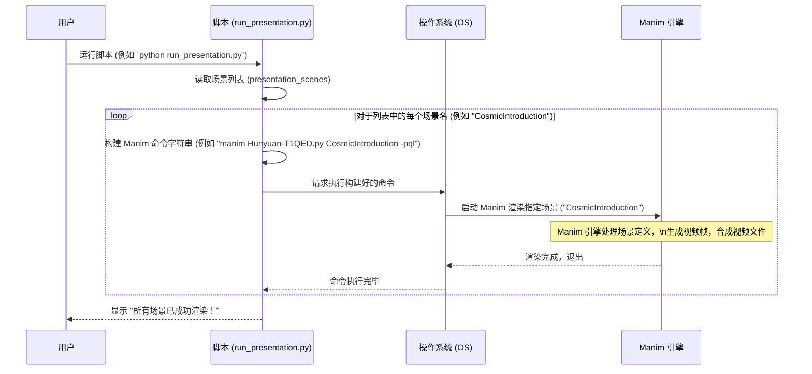

# Chapter 5: 动画编排脚本 (Animation Orchestration Script)


欢迎来到第五章！在上一章 [三维场景与相机 (3D Scene & Camera)](04_三维场景与相机__3d_scene___camera__.md) 中，我们学习了如何利用 `ThreeDScene` 和相机控制来创建引人入胜的三维动画。我们已经掌握了如何制作单个动画片段，也就是 [Manim 场景 (Manim Scene)](03_manim_场景__manim_scene__.md)。

但是，想象一下，你想制作一个更宏大的项目，比如一个关于量子电动力学 (QED) 的完整科普视频。这个视频可能包含好几个部分：开篇介绍、闵可夫斯基时空、场的可视化、麦克斯韦方程、拉格朗日量、费曼图、耦合常数、重整化，最后是总结。每一个部分都可以制作成一个独立的 Manim 场景。

问题来了：难道我们要为每一个场景手动运行一次 `manim` 命令吗？比如：
```bash
python -m manim Hunyuan-T1QED.py CosmicIntroduction -pql
python -m manim Hunyuan-T1QED.py MinkowskiSpace -pql
python -m manim Hunyuan-T1QED.py FieldVisual -pql
# ... 对所有场景重复 ...
```
这样做既繁琐又容易出错。特别是当场景很多，或者你需要经常重新渲染整个系列时，效率非常低。

有没有一种方法可以像播放音乐列表一样，自动地、按顺序地渲染所有这些场景呢？

答案是肯定的！这正是本章要介绍的 **动画编排脚本 (Animation Orchestration Script)** —— 在 `Math-To-Manim` 项目中，它就是 `run_presentation.py` 文件。

## 什么是动画编排脚本？

动画编排脚本就像是一位电影导演的 **场记板** 或者音乐播放器的 **播放列表**。它本身不包含任何动画内容（动画内容在像 `Hunyuan-T1QED.py` 这样的文件里定义），它的主要工作是 **规定** 哪些动画场景（Scenes）需要被渲染，以及按照 **什么顺序** 来渲染。

在 `Math-To-Manim` 项目中，`run_presentation.py` 就是这样一个 Python 脚本。它的核心功能是：

1.  **定义顺序:** 包含一个列表，里面按顺序列出了需要渲染的所有 [Manim 场景 (Manim Scene)](03_manim_场景__manim_scene__.md) 的名字。
2.  **自动执行:** 遍历这个列表，并为列表中的每个场景名字自动调用 Manim 的命令行工具来渲染该场景。
3.  **批量处理:** 让你只需要运行这一个脚本，就能批量生成构成整个演示或复杂动画的所有视频片段。

这极大地简化了管理和生成包含多个动画片段的复杂项目的流程。

## 如何使用编排脚本 (`run_presentation.py`)？

让我们来看看 `Math-To-Manim` 项目中的 `run_presentation.py` 是如何工作的。这个脚本主要是为了渲染 `Hunyuan-T1QED.py` 文件中定义的一系列关于量子电动力学的场景。

**1. 查看脚本内容 (简化版):**

下面是 `run_presentation.py` 核心部分的简化代码：

```python
#!/usr/bin/env python
# 导入必要的库
import sys # 用于处理命令行参数
import os  # 用于执行操作系统命令 (比如运行 manim)

# 1. 定义演示的场景顺序
# 这是一个列表，包含了所有要渲染的场景类的名字
# 这些场景类都在 Hunyuan-T1QED.py 文件中定义
presentation_scenes = [
    "CosmicIntroduction",  # 场景1：宇宙介绍
    "MinkowskiSpace",    # 场景2：闵可夫斯基时空
    "FieldVisual",       # 场景3：场的可视化
    "MaxwellEquations",  # 场景4：麦克斯韦方程
    "LagrangianDensity", # 场景5：拉格朗日密度
    "FeynmanDiagram",    # 场景6：费曼图
    "CouplingConstant",  # 场景7：耦合常数
    "Renormalization",   # 场景8：重整化
    "FinalScene"         # 场景9：最终场景
]

if __name__ == "__main__":
    # (省略了处理命令行参数来设置渲染质量的代码)
    quality = "l" # 默认使用低质量 (l) 以便快速预览

    # (省略了创建输出目录的代码)

    # 2. 按顺序渲染所有场景
    # 遍历上面定义的场景列表
    for i, scene_name in enumerate(presentation_scenes):
        # 打印当前正在渲染的场景信息
        print(f"正在渲染场景 {i+1}/{len(presentation_scenes)}: {scene_name}")
        
        # 3. 构建并执行 Manim 命令
        # 这行代码是核心：它调用操作系统的命令行来运行 manim
        # 对于列表中的每个 scene_name，它都会运行一次 manim
        # 例如，第一次循环会执行: python -m manim Hunyuan-T1QED.py CosmicIntroduction -pql
        os.system(f"python -m manim Hunyuan-T1QED.py {scene_name} -pq{quality}")

    # 所有场景渲染完毕后打印成功信息
    print("所有场景已成功渲染！")
    print("视频文件位于 media/videos/Hunyuan-T1QED/ 目录中。")
```

**代码解释:**

*   **`presentation_scenes` 列表:** 这是最重要的部分。它定义了要渲染哪些场景以及它们的顺序。这里的每个字符串（如 `"CosmicIntroduction"`）都必须对应 `Hunyuan-T1QED.py` 文件中定义的一个 [Manim 场景 (Manim Scene)](03_manim_场景__manim_scene__.md) 类名。
*   **`for` 循环:** 脚本使用一个 `for` 循环来遍历 `presentation_scenes` 列表中的每一个场景名称。
*   **`os.system(...)`:** 这是执行魔法的地方。`os.system()` 函数可以让你在 Python 脚本中执行操作系统的命令行指令。
*   **f-string 格式化:** `f"..."` 是一种 Python 的字符串格式化方式。这里用它来动态构建 `manim` 命令。`{scene_name}` 会被替换为当前循环中的场景名（例如 `"CosmicIntroduction"`），`{quality}` 会被替换为渲染质量（例如 `"l"`）。所以，它会依次生成并执行类似 `python -m manim Hunyuan-T1QED.py CosmicIntroduction -pql` 这样的命令。

**2. 运行脚本:**

要使用这个编排脚本，你只需要在你的终端（命令行）中，切换到包含 `run_presentation.py` 和 `Hunyuan-T1QED.py` 的项目目录下，然后运行：

```bash
python run_presentation.py
```

（你也可以选择性地在后面添加质量参数，比如 `python run_presentation.py h` 来指定高质量渲染，如果脚本支持的话。）

**3. 查看结果:**

脚本会开始执行。你会在终端看到它打印出类似这样的信息：

```
正在渲染场景 1/9: CosmicIntroduction
... (Manim 渲染 CosmicIntroduction 场景的输出) ...
正在渲染场景 2/9: MinkowskiSpace
... (Manim 渲染 MinkowskiSpace 场景的输出) ...
... (以此类推) ...
所有场景已成功渲染！
视频文件位于 media/videos/Hunyuan-T1QED/ 目录中。
```

脚本会依次调用 Manim 来渲染 `presentation_scenes` 列表中的每一个场景。最终，你会在 Manim 默认的媒体输出目录（通常是项目下的 `media/videos/` 加上源文件名，比如 `media/videos/Hunyuan-T1QED/`）找到所有生成的视频文件，每个文件对应列表中的一个场景。例如，你会看到 `CosmicIntroduction.mp4`, `MinkowskiSpace.mp4`, `FieldVisual.mp4` 等等。

现在，你只需要把这些视频片段按顺序拼接起来，就可以得到完整的演示视频了！

## 内部实现：编排脚本是如何工作的？

`run_presentation.py` 的原理其实非常简单，它并没有涉及复杂的 Manim 内部机制，更多的是利用了 Python 的基本功能来自动化命令行操作。

**非代码流程 walkthrough:**

1.  **启动:** 用户在命令行运行 `python run_presentation.py`。
2.  **读取列表:** 脚本内部读取预先定义好的 `presentation_scenes` 列表。
3.  **循环开始:** 脚本进入一个循环，依次处理列表中的每个场景名称。
4.  **构建命令:** 在每次循环中，脚本使用当前场景名称和指定的渲染质量，通过字符串拼接（或 f-string）的方式，构建出一个完整的 `manim` 命令行指令。例如，对于第一个场景 `"CosmicIntroduction"` 和低质量 `"l"`，它会构建出字符串 `"python -m manim Hunyuan-T1QED.py CosmicIntroduction -pql"`。
5.  **执行命令:** 脚本使用 `os.system()` 函数，将构建好的命令字符串传递给操作系统去执行。这就像你手动在终端输入并回车执行了这条命令一样。
6.  **等待完成:** `os.system()` 会阻塞（等待），直到操作系统完成了这个 Manim 命令的执行（即 Manim 引擎渲染完当前场景并退出）。
7.  **继续循环:** 脚本继续下一次循环，处理列表中的下一个场景名称，重复步骤 4-6。
8.  **结束:** 当列表中的所有场景都处理完毕后，循环结束，脚本打印最终的完成信息。

**序列图示例:**

这个简单的序列图展示了基本流程：



**代码层面:**

我们再看一下 `run_presentation.py` 中的关键部分：

```python
# 1. 场景列表：定义了“剧本”的顺序
presentation_scenes = [
    "CosmicIntroduction",
    "MinkowskiSpace",
    # ... 其他场景名 ...
    "FinalScene"
]

# ...

# 2. 循环：遍历剧本的每一幕
for i, scene_name in enumerate(presentation_scenes):
    print(f"正在渲染场景 {i+1}/{len(presentation_scenes)}: {scene_name}")

    # 3. 执行器：调用 Manim 来演出每一幕
    #    - "python -m manim": 调用 Manim
    #    - "Hunyuan-T1QED.py": 指定包含场景定义的剧本文件
    #    - "{scene_name}": 指定要演出的具体是哪一幕 (哪个场景类)
    #    - "-pq{quality}": 指定演出的参数 (预览、质量等级)
    command = f"python -m manim Hunyuan-T1QED.py {scene_name} -pq{quality}"
    os.system(command) # 把指令交给操作系统去执行
```

这里的核心就是理解 `os.system()`。它只是简单地将一个字符串当作命令来执行。这个编排脚本的巧妙之处在于，它利用 Python 的循环和字符串处理能力，**自动化** 了我们原本需要手动重复执行的一系列 `manim` 命令。它并没有改变 Manim 本身的渲染方式，只是让调用 Manim 的过程变得更加方便和可管理。

## 总结

在本章中，我们学习了 **动画编排脚本 (Animation Orchestration Script)** 的概念，并通过 `Math-To-Manim` 项目中的 `run_presentation.py` 示例了解了它的作用和用法。我们知道了：

*   编排脚本用于 **自动按顺序渲染** 多个 [Manim 场景 (Manim Scene)](03_manim_场景__manim_scene__.md)。
*   它通过定义一个包含场景名称的 **列表**，并 **循环调用** `manim` 命令行工具来实现。
*   这极大地简化了管理和生成包含多个动画片段的 **复杂项目**。

掌握了编排脚本，你就拥有了一个强大的工具来组织你的 Manim 项目，特别是当你需要创建一系列相互关联的动画时。它让你可以专注于每个场景的内容创作，而把批量渲染的任务交给脚本来完成。

了解了项目的结构、AI 交互、场景定义、三维空间以及如何编排渲染，我们对 `Math-To-Manim` 的工作方式已经有了比较全面的认识。但是，一个好的项目不仅要有能工作的代码，还需要清晰的文档和说明。在下一章 [项目文档与说明 (Project Documentation)](06_项目文档与说明__project_documentation__.md) 中，我们将探讨项目文档的重要性，以及如何通过文档来更好地理解和使用 `Math-To-Manim`。

---

