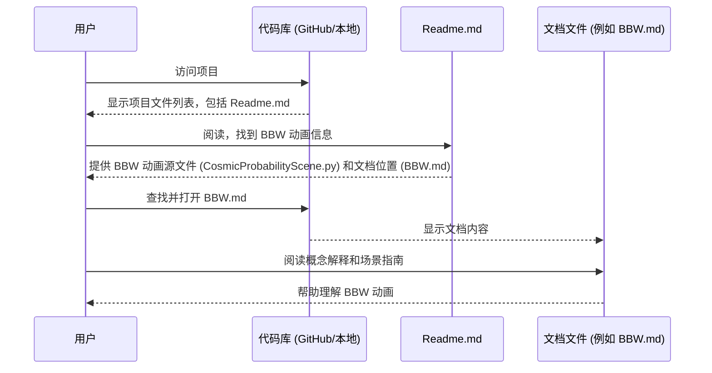

# Chapter 6: 项目文档与说明 (Project Documentation)


在上一章 [动画编排脚本 (Animation Orchestration Script)](05_动画编排脚本__animation_orchestration_script__.md) 中，我们学习了如何使用像 `run_presentation.py` 这样的脚本来自动化渲染一系列复杂的 Manim 场景。这使得生成长篇演示或复杂动画变得更加高效。

但是，想象一下，你刚刚接触 `Math-To-Manim` 这个项目，或者你想要理解某个特定动画背后的复杂数学概念，又或者你在运行项目时遇到了一个奇怪的问题。这时，仅仅有代码和自动运行脚本是不够的。你需要一份“说明书”或者“开发日记”来指引你。

这就是 **项目文档与说明 (Project Documentation)** 的作用。它们是理解项目、使用项目、解决问题的关键。本章将带你了解 `Math-To-Manim` 项目中包含的各种文档，以及如何利用它们。

## 为什么需要项目文档？

一个软件项目，尤其是像 `Math-To-Manim` 这样涉及 AI、复杂数学和可视化技术的项目，通常包含很多移动的部分。如果没有好的文档，新用户（甚至几个月后的你自己）可能会感到迷茫：

*   这个项目到底是做什么的？
*   如何安装和运行它？
*   这些复杂的 Python 脚本（比如 `Hunyuan-T1QED.py`）究竟在展示什么数学概念？
*   运行某个组件（比如提到的 MCP 服务器）时出错了，该如何解决？

**项目文档就像是项目的地图和指南。** 它们帮助你：

1.  **理解目标：** 快速了解项目的核心目的和功能。
2.  **快速上手：** 按照说明完成安装、配置和基本操作。
3.  **深入概念：** 理解动画所涉及的复杂数学或物理知识。
4.  **解决问题：** 查找常见问题的解决方案或学习开发者排查问题的过程。
5.  **贡献代码（如果项目开源）：** 了解项目结构和规范，以便参与开发。

## 核心概念：`Math-To-Manim` 中的文档类型

`Math-To-Manim` 代码库包含了多种类型的文档，它们通常以 Markdown (`.md`) 或 LaTeX (`.tex`) 文件的形式存在。让我们看看主要的几种：

### 1. `Readme.md`：项目的大门

`Readme.md` 文件通常是你在 GitHub 或其他代码托管平台上看到的项目首页。它是了解项目的**第一站**。

`Math-To-Manim` 的 `Readme.md` 包含了非常重要的信息：

*   **项目概述 (Project Overview):** 解释项目使用 AI (DeepSeek, Gemini, Grok) 和 Manim 来生成数学动画。
*   **重要提示 (Important Note):** **特别强调** 这个代码库只包含 AI 生成的**输出文件**（Manim 脚本），**不包含**生成这些脚本的 AI 模型或完整流程。这是一个关键信息，避免用户误解项目范围。
*   **快速上手 (Quick Start):** 提供克隆代码库、设置环境（`.env` 文件、`requirements.txt`）、安装 FFmpeg 和启动界面的基本步骤。
*   **目录结构 (Directory Structure):** 简要介绍项目文件的组织方式。
*   **可用动画 (Available Animations):** 列出一些示例动画，包括它们的源文件 (`.py`)、相关文档和渲染命令。这是寻找具体例子和运行方法的好地方。
*   **渲染选项 (Rendering Options):** 解释 `manim` 命令的不同质量参数（`-ql`, `-qh` 等）和标志（`-p`）。
*   **开发提示 (Development Tips):** 提供一些提高开发效率的建议。
*   **提示词要求 (Prompt Requirements):** 强调需要**非常详细**的提示词，并指出使用 **LaTeX** 语法进行提示是关键技巧。还提供了一个非常长的 QED 提示词作为例子。
*   **文档说明 (Documentation):** 指出项目包含 `.md` 和 `.tex` 文档，并提供了查看 QED 文档 PDF 的链接。
*   **引用信息 (Citation):** 提供引用项目的方式。

**`Readme.md` 就像是项目的目录和快速入门指南，是你开始探索的第一步。**

### 2. 故障排查指南 (Troubleshooting Guides)

在开发和使用过程中，难免会遇到问题。`Math-To-Manim` 项目包含了一些记录问题解决过程的文档，例如提供的 `MCPPostMortem.md` 和 `MCP_Troubleshooting_Guide.md`。

这些文件详细记录了解决特定技术问题（例如 MCP 服务器连接失败）的完整过程：

*   **概述 (Overview):** 简要说明遇到的问题。
*   **初始问题 (Initial Problems):** 列出导致问题的具体原因（如 JSON 语法错误、环境变量问题）。
*   **分步排查过程 (Step-by-Step Troubleshooting Process):** 详细描述了开发者为了定位和解决问题所采取的每一步，包括尝试的命令、遇到的错误信息、修改的配置文件等。
*   **最终解决方案 (Final Solution):** 清晰地给出最终有效的解决方法。
*   **如何应用修复 (How to Apply the Fix):** 提供具体的操作步骤，让其他遇到相同问题的人可以 따라做。
*   **经验教训 (Lessons Learned):** 总结从这次问题中学到的经验，对未来有指导意义。
*   **未来排查建议 (Troubleshooting Tips for Future...):** 提供通用的排查思路。

**这类文档就像是开发者的“破案笔记”或“维修手册”。** 它们不仅能帮助解决特定问题，还能让你学习到解决问题的思路和方法。

下面是 `MCP_Troubleshooting_Guide.md` 中的一小段，展示了其结构：

```markdown
## Step-by-Step Troubleshooting Process

### 1. Fixing JSON Syntax Errors

The first issue was with the JSON syntax in the configuration files:

**Original Cline MCP settings file** (with errors):
```json
mcpServers": {
    # ... (省略了有错误的代码) ...
}
```

Problems:
- Missing opening curly brace
- Missing commas after each property
- Missing comma in the args array

**Fixed Cline MCP settings file**:
```json
{
  "mcpServers": {
    # ... (省略了修正后的代码) ...
  }
}
```
### 2. Addressing PATH Issues
# ... (后续步骤) ...
```

**代码解释:**

这个片段清晰地展示了第一个问题（JSON 语法错误），指出了具体错误点，并给出了修正后的代码。这种结构非常有助于理解和复现。

### 3. 概念解释文件 (Concept Explanation Files)

`Math-To-Manim` 项目的核心是将复杂的数学或物理概念可视化。因此，解释这些概念的文档至关重要。这些文档可能位于 `Documentation/` 或 `docs/` 目录下，或者与相关的动画脚本放在一起。

例如，项目提到了：

*   **`Benamou-Brenier-Wasserstein.md`:** 解释贝纳姆-布伦尼尔定理和瓦瑟斯坦距离的概念，可能还包括了动画的场景指南。
*   **`ElectroweakMeaning.md`:** 解释电弱对称性破缺理论。
*   **`/docs` 目录中的 PDF 文件 (如 `QwenQED.pdf`):** 这些可能是由 LaTeX (`.tex`) 文件编译而成的，提供了更深入、更规范的数学解释和学习笔记，有时甚至是 AI 辅助生成的。

这类文档就像是**动画的“伴读材料”或“科学背景介绍”**。它们帮助你理解动画不仅仅是漂亮的画面，更是对某个科学原理的视觉呈现。

例如，`Benamou-Brenier-Wasserstein.md` 中可能包含这样的内容（简化示例）：

```markdown
## Scene 1: Introducing the Cosmic Distributions - \( \alpha_0 \) and \( \alpha_1 \)

**What You See:**
The animation begins in a **dark cosmic void**... two distinct, swirling entities emerging... **\( \alpha_0 \) and \( \alpha_1 \)**... visualized as vibrant, dynamic **spiral galaxies**...

**Concept Explanation:**
We start by visualizing **probability distributions**. Imagine them as **galaxies**...
*   **\( \alpha_0 \)** represents the **initial probability distribution**...
*   **\( \alpha_1 \)** is the **target probability distribution**...
```

**代码解释:**

这个 Markdown 片段结合了对动画**视觉呈现**的描述和对背后**核心概念**（概率分布）的解释，并使用了形象的**比喻**（星系），非常适合帮助理解。

## 如何使用项目文档？

现在你知道了项目中有哪些类型的文档，那么如何有效地利用它们呢？

1.  **从 `Readme.md` 开始：**
    *   首先通读 `Readme.md` 文件。了解项目的目标、基本用法、特别是那个“重要提示”（关于只提供输出脚本）。
    *   按照“快速上手”部分设置好你的环境。
    *   浏览“可用动画”部分，找到你感兴趣的例子。

2.  **探索特定动画：**
    *   如果你对某个特定动画（比如 QED 或 BBW）感兴趣，找到 `Readme.md` 中对应的 `.py` 文件名（如 `Hunyuan-T1QED.py`, `CosmicProbabilityScene.py`）。
    *   尝试运行 `Readme.md` 中提供的渲染命令来生成动画。
    *   查找与该动画相关的文档文件（可能在 `Documentation/` 目录，或文件名相似的 `.md`, `.tex` 文件，或 `Readme.md` 中直接链接的 PDF）。阅读这些文档来理解动画背后的数学或物理概念。

3.  **解决问题：**
    *   如果在安装、配置或运行过程中遇到问题（比如前面提到的 MCP 服务器问题），首先检查 `Readme.md` 的“快速上手”和“开发提示”部分。
    *   如果问题比较具体，可以搜索项目代码库中是否有名为 `Troubleshooting`, `FAQ`, `Postmortem` 或包含错误信息的 `.md` 文件。仔细阅读这些故障排查指南，看看是否有类似的问题和解决方案。

4.  **理解 AI 交互和提示：**
    *   仔细阅读 `Readme.md` 中关于提示词工程的部分，特别是对**细节**和 **LaTeX** 的强调。研究那个长长的 QED 提示词示例，体会需要提供给 AI 的信息量。
    *   如果你使用了 `app.py` 与 AI 交互，可以参考 `Readme.md` 中关于 AI 模型（DeepSeek 等）和交互界面的说明。

**把文档想象成你的向导，遇到不清楚的地方就去查阅对应的文档。**

## 内部实现：文档是如何组织的？

项目文档并不是凭空产生的，它们是开发者在项目过程中有意创建和组织的。

**非代码流程 walkthrough:**

1.  **创建 (Creation):** 开发者在编写代码、设计动画或解决问题时，会意识到需要记录某些信息。
    *   项目启动时，创建 `Readme.md` 介绍项目。
    *   实现一个复杂动画后，创建 `.md` 或 `.tex` 文件解释其背后的科学概念。
    *   解决一个棘手 bug 后，创建 `Troubleshooting.md` 记录过程和解决方案。
    *   有时，如 `Readme.md` 所述，AI 也可以辅助生成文档（例如，从代码生成 LaTeX 学习笔记）。
2.  **格式选择 (Format Choice):** 通常选择 Markdown (`.md`) 格式，因为它语法简单、易于阅读和编辑，并且在 GitHub 等平台上能很好地渲染。对于包含大量复杂公式的文档，可能会选择 LaTeX (`.tex`)，然后编译成 PDF。
3.  **组织 (Organization):** 文档文件通常放置在容易找到的地方：
    *   `Readme.md` 必须在项目根目录。
    *   通用的文档或大型文档集合可能放在顶层的 `docs/` 或 `Documentation/` 目录。
    *   与特定代码文件紧密相关的文档，有时会放在同一目录下或使用相似的文件名。
    *   故障排查文档可能放在根目录或 `docs/` 下。
4.  **维护 (Maintenance):** 随着项目的发展，代码会变化，文档也需要相应地更新，以保持其准确性和有效性。

**序列图示例：查找并使用文档**

这个简单的图表展示了一个用户如何利用项目文档来理解一个概念：



**代码层面 (文档本身就是“代码”):**

文档主要是文本文件，但它们的**结构**很重要。以 `MCPPostMortem.md` 为例，其结构遵循了良好的问题记录实践：

```markdown
# MCP Server Troubleshooting Guide

## Overview
# ... (问题简介) ...

## Initial Problems
# ... (列出具体问题点) ...

## Step-by-Step Troubleshooting Process
### 1. Fixing JSON Syntax Errors
# ... (描述步骤1) ...
### 2. Addressing PATH Issues
# ... (描述步骤2) ...

## Final Solution
# ... (给出最终方法) ...

## Lessons Learned
# ... (总结经验) ...
```

这种结构化的方式使得信息清晰、易于查找和理解。同样，`Readme.md` 使用标题、列表、代码块等 Markdown 元素来组织信息，使其易于导航。

## 总结

本章我们探讨了 **项目文档与说明 (Project Documentation)** 在 `Math-To-Manim` 项目中的重要性。我们了解到：

*   文档是理解项目、快速上手、深入概念和解决问题的关键。
*   项目中包含多种文档：`Readme.md` (项目入口)、故障排查指南 (解决问题)、概念解释文件 (理解科学背景)。
*   这些文档通常使用 Markdown (`.md`) 或 LaTeX (`.tex`) 编写，并有良好的组织结构。
*   学会查找和利用这些文档，能极大地提升你使用和理解 `Math-To-Manim` 项目的效率。

良好的文档是任何成功项目不可或缺的一部分。它们是开发者与用户（以及未来的自己）沟通的桥梁。

到目前为止，我们已经了解了项目的核心逻辑、AI 交互、场景、三维空间、渲染编排以及文档。但一个复杂的项目往往还需要一些可复用的“小工具”来处理常见的任务。在下一章 [辅助工具类/函数 (Utility Classes/Functions)](07_辅助工具类_函数__utility_classes_functions__.md) 中，我们将看看 `Math-To-Manim` 项目中可能包含的一些帮助简化代码和提高效率的辅助工具。

---

