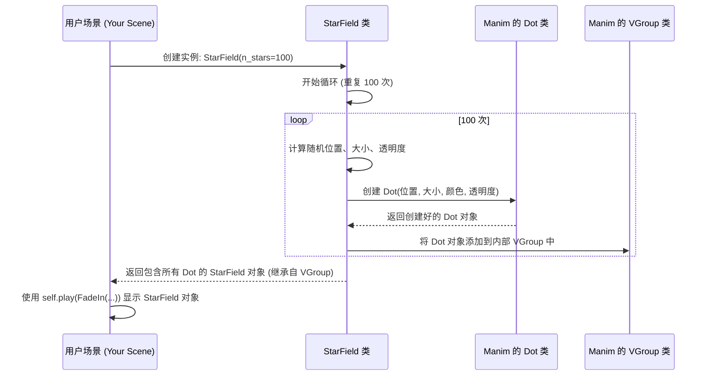

# Chapter 7: 辅助工具类/函数 (Utility Classes/Functions)


在上一章 [项目文档与说明 (Project Documentation)](06_项目文档与说明__project_documentation__.md) 中，我们了解了如何通过阅读文档来理解 `Math-To-Manim` 项目的结构、用法和解决遇到的问题。文档就像是项目的地图和指南。

现在，假设你在制作动画时，发现有些效果或背景需要反复创建。例如，你可能想在好几个场景中都使用星空背景，或者需要多次展示某个特定的数学曲面。每次都从头编写相同的代码会非常繁琐，而且容易出错。

这就是**辅助工具类/函数 (Utility Classes/Functions)** 发挥作用的地方。它们就像一个工具箱里的预制零件或专用工具，可以帮助我们快速、方便地创建常用的视觉元素或效果，而无需每次都重新发明轮子。`Math-To-Manim` 代码库包含了一些这样的工具，让动画制作过程更高效。

## 为什么要使用辅助工具？

想象一下，你正在装修房子。如果你需要拧螺丝，你会选择每次都自己用铁块打磨一个螺丝刀，还是直接从工具箱里拿一个现成的螺丝刀？显然是后者更方便快捷。

辅助工具类/函数就是编程中的“现成工具”。它们封装（打包）了一些常用的功能或视觉元素的创建逻辑。当你需要某个特定效果时，只需要调用这个工具，传入一些简单的参数（比如星星的数量、曲面的范围），它就能帮你生成所需的 Manim 对象。

**核心优势：**

1.  **可重用性 (Reusability):** 编写一次，到处使用。
2.  **简洁性 (Simplicity):** 让你的场景代码更短、更清晰，专注于动画逻辑本身，而不是底层的创建细节。
3.  **一致性 (Consistency):** 确保相同的效果在不同场景中看起来一致。
4.  **效率 (Efficiency):** 节省大量重复编写代码的时间。

`Math-To-Manim` 项目提供了一些这样的实用工具，我们来看几个例子。

## 核心概念与示例

### 1. `StarField` 类：快速创建星空

很多宇宙或抽象主题的动画都需要一个星空背景。`StarField` 类就是为此设计的。它能快速生成一片随机分布的、亮度大小不一的星星（实际上是很多小的 `Dot` 对象）。

**如何使用？**

在你的 [Manim 场景 (Manim Scene)](03_manim_场景__manim_scene__.md) 的 `construct` 方法中，像创建其他 Manim 对象一样创建 `StarField` 的实例，然后用 `self.play` 动画播放它即可。

```python
# 导入 Manim 库和 StarField 类
from manim import Scene, FadeIn
# 假设 StarField 类在同一个文件或已导入
# (实际代码中可能需要从特定文件导入，例如 from utils import StarField)
from typing import Sequence # 只是为了让示例可运行，StarField 定义在别处

# 假设 StarField 定义如下 (来自 Hunyuan-T1QED.py 的简化版)
from manim import VGroup, Dot, WHITE
import random

class StarField(VGroup):
    def __init__(self, n_stars=100, width=16, height=9, **kwargs):
        super().__init__(**kwargs)
        for _ in range(n_stars):
            star = Dot(
                point=[random.uniform(-width/2, width/2), # x 坐标
                       random.uniform(-height/2, height/2), # y 坐标
                       random.uniform(-5, 5)], # z 坐标 (增加深度感)
                radius=random.uniform(0.01, 0.04), # 星星大小随机
                color=WHITE,
                stroke_width=0
            ).set_opacity(random.uniform(0.5, 1.0)) # 星星亮度随机
            self.add(star)

# 创建一个场景来展示 StarField
class StarrySkyScene(Scene):
    def construct(self):
        # 1. 创建 StarField 对象
        #    n_stars 参数指定星星的数量
        star_background = StarField(n_stars=300) 

        # 2. 使用 FadeIn 动画显示星空
        self.play(FadeIn(star_background, run_time=3))

        # 3. (可选) 添加其他动画...
        # my_text = Text("你好，星空!")
        # self.play(Write(my_text))

        self.wait(2) # 暂停观看
```

**代码解释:**

*   我们首先假设 `StarField` 类已经被定义或导入。
*   在 `StarrySkyScene` 的 `construct` 方法中，我们用 `StarField(n_stars=300)` 创建了一个包含 300 颗星星的背景。
*   然后用 `FadeIn` 动画将这个背景慢慢显示出来。

看，只需要一行代码 `StarField(n_stars=300)`，你就得到了一个漂亮的星空背景，无需手动创建几百个 `Dot`。

### 2. 数学曲面生成函数

在科学可视化中，经常需要展示三维的数学曲面，比如某个函数的图像或者物理模型。`Math-To-Manim` 代码库（尤其在 `optionskew.py` 中）提供了一些函数来生成特定的曲面，例如：

*   `create_black_scholes_surface(...)`: 创建布莱克-斯科尔斯模型相关的曲面（可能代表波动率）。
*   `create_heat_equation_surface(...)`: 创建一个看起来像热量扩散或波动的曲面。

这些函数通常接收定义域范围（如 `u_min`, `u_max`）和分辨率作为参数，然后返回一个可以直接在 [三维场景与相机 (3D Scene & Camera)](04_三维场景与相机__3d_scene___camera__.md) 中使用的 `Surface` 对象。

**如何使用？**

```python
# 导入 Manim 库和相关的辅助函数
from manim import ThreeDScene, Create, Axes, DEGREES, Surface, BLUE_D, BLUE_B
import numpy as np

# 假设 create_heat_equation_surface 定义如下 (来自 optionskew.py 的简化版)
def create_heat_equation_surface(u_min=-3, u_max=3, v_min=-3, v_max=3, resolution=30):
    """创建一个模拟热扩散的波浪状曲面。"""
    def surface_func(u, v):
        x = u
        y = v
        r2 = x**2 + y**2
        # 一个简单的波浪 + 高斯函数，仅作示意
        z = 0.8 * np.exp(-0.3*r2) * np.sin(2*r2)
        return np.array([x, y, z])

    surface_mesh = Surface(
        surface_func,
        u_range=[u_min, u_max],
        v_range=[v_min, v_max],
        resolution=(resolution, resolution),
        fill_opacity=0.7,
        checkerboard_colors=[BLUE_D, BLUE_B] # 使用棋盘格颜色
    )
    return surface_mesh

# 创建一个三维场景来展示曲面
class SurfaceDemoScene(ThreeDScene):
    def construct(self):
        # 设置相机视角
        self.set_camera_orientation(phi=60 * DEGREES, theta=-45 * DEGREES)

        # 1. 创建坐标轴
        axes = ThreeDAxes()
        self.play(Create(axes))

        # 2. 调用辅助函数创建热力图曲面
        heat_surface = create_heat_equation_surface(
            u_min=-4, u_max=4,
            v_min=-4, v_max=4,
            resolution=40 # 提高分辨率使曲面更平滑
        )

        # 3. 播放创建曲面的动画
        self.play(Create(heat_surface, run_time=3))

        # (可选) 添加相机旋转等动画
        # self.begin_ambient_camera_rotation(rate=0.1)
        self.wait(4)
```

**代码解释:**

*   我们导入了 `ThreeDScene` 因为要展示三维曲面。
*   假设 `create_heat_equation_surface` 函数已经定义。
*   在 `construct` 方法中，我们调用 `create_heat_equation_surface(...)` 并传入范围和分辨率参数，它返回了一个 `Surface` 对象 `heat_surface`。
*   我们用 `Create` 动画来显示这个曲面。

同样地，我们不需要关心曲面背后复杂的数学计算和 `Surface` 对象的配置细节，只需调用一个函数即可。

### 3. 粒子和路径生成函数

有时我们需要创建大量的粒子（点云）或者随机路径来模拟某些效果，比如：

*   `create_spherical_point_cloud(...)`: 在球体内随机生成点。
*   `create_random_paths_3d(...)`: 生成多条随机游走的 3D 路径。

**如何使用？**

```python
# 导入 Manim 库和相关辅助函数
from manim import ThreeDScene, Create, VGroup, Dot3D, YELLOW, PI
import numpy as np

# 假设 create_spherical_point_cloud 定义如下 (来自 optionskew.py 的简化版)
def create_spherical_point_cloud(num_points=100, radius=3):
    """在给定半径的球体内创建随机分布的点云。"""
    points = VGroup()
    for _ in range(num_points):
        # 随机方向，随机半径
        theta = np.random.uniform(0, 2*PI)
        phi = np.random.uniform(0, PI)
        r = np.random.uniform(0, radius)
        x = r * np.sin(phi) * np.cos(theta)
        y = r * np.sin(phi) * np.sin(theta)
        z = r * np.cos(phi)
        dot = Dot3D(point=[x, y, z], radius=0.05, color=YELLOW)
        points.add(dot)
    return points

# 创建一个三维场景展示点云
class PointCloudScene(ThreeDScene):
    def construct(self):
        self.set_camera_orientation(phi=75*DEGREES, theta=-45*DEGREES)

        # 1. 调用辅助函数创建球形点云
        point_cloud = create_spherical_point_cloud(num_points=300, radius=4)

        # 2. 播放动画显示点云
        self.play(Create(point_cloud, lag_ratio=0.01), run_time=4) # lag_ratio 让点逐个出现

        self.wait(3)
```

**代码解释:**

*   调用 `create_spherical_point_cloud(num_points=300, radius=4)` 生成包含 300 个随机分布在半径为 4 的球内的黄色点。
*   使用 `Create` 动画并设置 `lag_ratio` 让点看起来像逐渐出现一样。

这些辅助工具极大地简化了创建复杂或重复性视觉元素的过程。

## 内部实现：工具是如何工作的？

理解这些辅助工具内部是如何实现的，能帮助我们更好地使用它们，甚至创建自己的工具。

**非代码流程 walkthrough:**

当你调用一个辅助类或函数时，它内部通常会执行以下步骤：

1.  **接收参数:** 获取你传入的参数（如星星数量 `n_stars`，曲面范围 `u_min`, `u_max` 等）。
2.  **计算/循环:** 根据参数进行必要的数学计算（如曲面点坐标）或执行循环（如创建多个星星）。
3.  **创建 Manim 对象:** 在计算或循环过程中，创建底层的 Manim 对象（如 `Dot`, `Surface`, `Line` 等），并根据参数设置它们的属性（位置、颜色、大小等）。
4.  **组合对象 (可选):** 如果工具生成了多个对象（比如 `StarField` 生成很多 `Dot`），通常会将它们组合到一个 `VGroup`（Manim 的组合对象）中。
5.  **返回结果:** 返回最终创建的 Manim 对象或 `VGroup`。

**序列图示例 (`StarField`):**

这个图展示了调用 `StarField` 类创建星空背景时的简化流程：



**代码层面 (`optionskew.py` 和 `Hunyuan-T1QED.py` 中的例子):**

让我们看看 `StarField` 和 `create_heat_equation_surface` 的简化内部实现：

*   **`StarField` (来自 `Hunyuan-T1QED.py`)**

```python
# 导入必要的 Manim 类
from manim import VGroup, Dot, WHITE
import random

# StarField 继承自 VGroup，这样它可以容纳多个 Dot 对象
class StarField(VGroup):
    # __init__ 是创建类实例时调用的方法
    def __init__(self, n_stars=100, width=16, height=9, **kwargs):
        # 调用父类 VGroup 的初始化方法
        super().__init__(**kwargs)
        
        # 核心逻辑：循环 n_stars 次
        for _ in range(n_stars):
            # 1. 计算随机属性
            pos = [random.uniform(-width/2, width/2), 
                   random.uniform(-height/2, height/2), 
                   random.uniform(-5, 5)]
            rad = random.uniform(0.01, 0.04)
            opacity = random.uniform(0.5, 1.0)

            # 2. 创建一个 Dot 对象
            star = Dot(
                point=pos, 
                radius=rad, 
                color=WHITE, 
                stroke_width=0
            ).set_opacity(opacity) # 设置透明度

            # 3. 将创建的 Dot 添加到 VGroup 中
            self.add(star) 
        # 循环结束后，StarField 对象就包含了所有创建的星星 Dot
```

**代码解释:**

*   `StarField` 继承自 `VGroup`，意味着它可以像一个列表一样管理多个 Manim 对象。
*   `__init__` 方法是类的构造函数。
*   关键在于 `for` 循环，它会执行 `n_stars` 次。
*   在每次循环中，它计算随机的位置、半径和透明度，然后创建一个 `Dot` 对象，并使用 `self.add(star)` 将这个 `Dot` 添加到 `StarField` 这个 `VGroup` 中。
*   当 `StarField(n_stars=100)` 被调用时，这个过程就会执行 100 次，最终返回一个包含 100 个 `Dot` 的 `VGroup`。

*   **`create_heat_equation_surface` (来自 `optionskew.py`)**

```python
# 导入 Manim 库和 numpy
from manim import Surface, BLUE_D, BLUE_B, np

# 这是一个函数，不是类
def create_heat_equation_surface(u_min=-3, u_max=3, v_min=-3, v_max=3, resolution=30):
    """创建一个模拟热扩散的波浪状曲面。"""
    
    # 1. 定义一个函数来计算曲面上每个点 (u, v) 的三维坐标 (x, y, z)
    def surface_func(u, v):
        x = u
        y = v
        r2 = x**2 + y**2
        # 这是具体的数学公式，决定了曲面的形状
        z = 0.8 * np.exp(-0.3*r2) * np.sin(2*r2) 
        return np.array([x, y, z]) # 返回 NumPy 数组表示的三维点

    # 2. 使用 Manim 的 Surface 类来创建曲面对象
    surface_mesh = Surface(
        surface_func,         # 传入计算坐标的函数
        u_range=[u_min, u_max], # 指定 u 的范围
        v_range=[v_min, v_max], # 指定 v 的范围
        resolution=(resolution, resolution), # 指定网格分辨率
        fill_opacity=0.7,     # 设置透明度
        checkerboard_colors=[BLUE_D, BLUE_B] # 设置棋盘格颜色
    )
    
    # 3. 返回创建好的 Surface 对象
    return surface_mesh
```

**代码解释:**

*   这个工具是一个函数，而不是类。
*   它首先定义了一个内部函数 `surface_func(u, v)`，这个函数是核心，它根据输入的参数 `u` 和 `v` 计算出对应曲面上点的 `(x, y, z)` 坐标。这里的数学公式 `z = ...` 决定了曲面的具体形状。
*   然后，它调用 Manim 的 `Surface` 类，将 `surface_func` 和其他参数（如范围、分辨率、颜色）传递给 `Surface`。Manim 的 `Surface` 类会内部调用 `surface_func` 很多次，计算出所有网格点的坐标，并构建出三维曲面。
*   最后，函数返回创建好的 `Surface` 对象。

这些例子展示了辅助工具如何通过封装底层的 Manim 对象创建逻辑（循环创建 `Dot` 或使用 `Surface` 计算坐标）来提供更简洁易用的接口。

## 总结

在本章中，我们学习了 **辅助工具类/函数 (Utility Classes/Functions)** 的概念及其在 `Math-To-Manim` 项目中的应用。我们了解到：

*   辅助工具是**可重用的代码组件**，用于简化常见视觉元素（如星空背景 `StarField`）或复杂计算（如数学曲面生成函数）的创建过程。
*   它们通过**封装**底层的 Manim 对象创建逻辑，提供更简洁的接口，提高了代码的**可重用性、简洁性和效率**。
*   使用这些工具就像从工具箱里拿出预制零件，能让你更快地搭建复杂的 [Manim 场景 (Manim Scene)](03_manim_场景__manim_scene__.md)。

通过本系列教程，我们从 [数学可视化逻辑 (Mathematical Visualization Logic)](01_数学可视化逻辑__mathematical_visualization_logic__.md) 出发，了解了 [AI 交互与生成 (AI Interaction & Generation)](02_ai_交互与生成__ai_interaction___generation__.md) 如何辅助创作，学习了 [Manim 场景 (Manim Scene)](03_manim_场景__manim_scene__.md) 和 [三维场景与相机 (3D Scene & Camera)](04_三维场景与相机__3d_scene___camera__.md) 的基础，掌握了使用 [动画编排脚本 (Animation Orchestration Script)](05_动画编排脚本__animation_orchestration_script__.md) 管理渲染流程，认识了 [项目文档与说明 (Project Documentation)](06_项目文档与说明__project_documentation__.md) 的重要性，最后还接触了能提高效率的辅助工具。

希望这个教程为你探索 `Math-To-Manim` 项目、利用 AI 和 Manim 进行数学与科学可视化打下了坚实的基础。现在，你可以更自信地去阅读项目中的代码、运行示例、甚至尝试创建你自己的精彩动画了！祝你在数学可视化的旅程中探索愉快！

---

