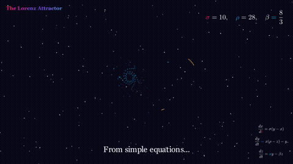
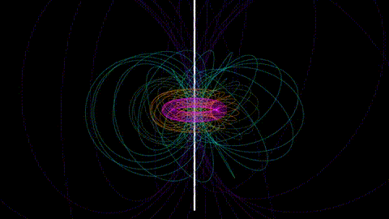
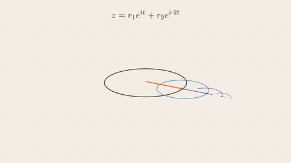
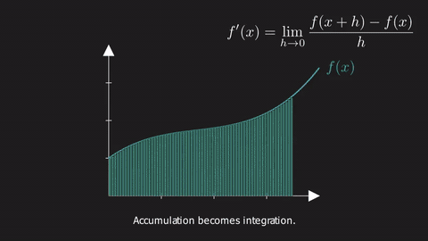
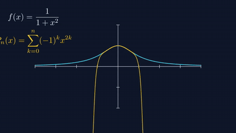
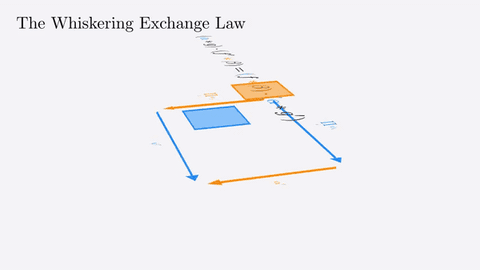
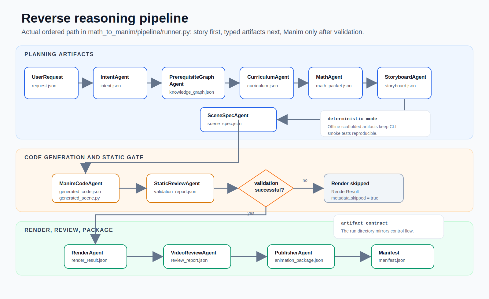
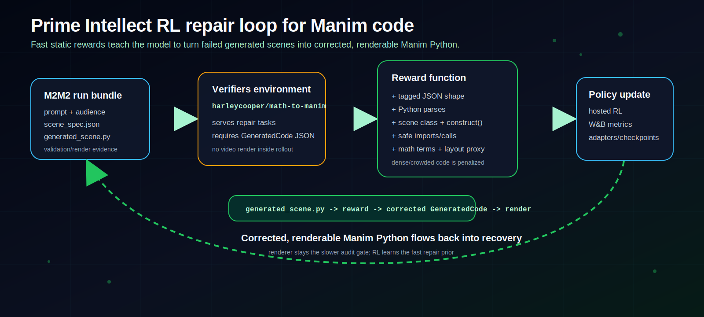
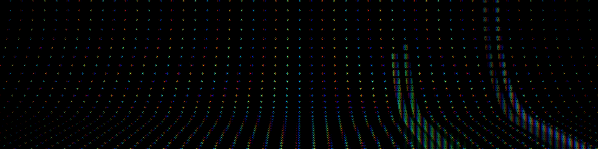
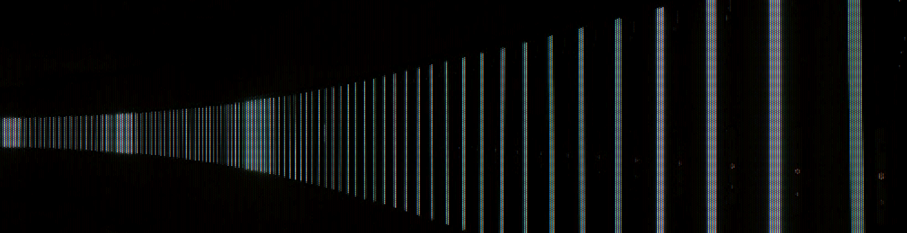

<div align="center">

<a href="https://www.star-history.com/#HarleyCoops/Math-To-Manim&Date">
  <picture>
    <source media="(prefers-color-scheme: dark)" srcset="https://api.star-history.com/svg?repos=HarleyCoops/Math-To-Manim&type=Date&theme=dark" />
    <source media="(prefers-color-scheme: light)" srcset="https://api.star-history.com/svg?repos=HarleyCoops/Math-To-Manim&type=Date" />
    
  </picture>
</a>

# Math to Manim 中文版

### 提一个问题 -> 得到一部经过推理的视频

[](https://www.python.org/)
[](https://www.manim.community/)
[](https://openai.github.io/openai-agents-python/)
[](#hermes-agent)
[](LICENSE)

[动效展厅](docs/showcase/README.md) · [架构](docs/ARCHITECTURE.md) · [Prime RL](docs/PRIME_INTELLECT_RL.md) · [路线图](docs/ROADMAP.md) · [Agent 指南](AGENTS.md)

<br />

<p align="center">
  
  
</p>

<br />

<p align="center">
  <a href="docs/showcase/README.md"></a>
  <a href="docs/showcase/README.md"></a>
  <a href="docs/showcase/README.md"></a>
  <a href="docs/showcase/README.md"></a>
</p>

<p align="center">
  <a href="docs/showcase/README.md"></a>
  <a href="docs/showcase/README.md"></a>
  <a href="docs/showcase/README.md"></a>
  <a href="docs/showcase/README.md"></a>
</p>

<p align="center">
  <a href="docs/showcase/README.md"></a>
  <a href="docs/showcase/README.md"></a>
  <a href="docs/showcase/README.md"></a>
  <a href="docs/showcase/README.md"></a>
</p>

**Math-To-Manim 把严肃的数学和物理提示词变成 Manim 讲解视频，同时保留生成它们的可复用产物：意图、先修知识图、课程计划、数学包、分镜、场景规格、生成代码、验证报告、渲染证据、审阅笔记和阶段追踪。**

[**浏览本地 GIF 展厅 ->**](docs/showcase/README.md)

<br />



<br />

<em>代码可追溯的工作流：每次运行都可以从 prompt 追到产物，再追到渲染结果。</em>

</div>

---

## 这是什么

**Math-To-Manim** 起源于 Donald Trump 第二次就职典礼当天的清晨。2025 年 1 月 20 日，大约我当地时间凌晨 4:30，中国 AI 实验室 DeepSeek 在 Hugging Face 上发布了 [R1](https://huggingface.co/deepseek-ai/DeepSeek-R1)。我把这个时间点理解为有意为之：一个类似 Sputnik 的信号，说明开放推理模型已经成为地缘政治现实。我的第一步是克隆 R1，并把它指向数学推理。

真正有意思的地方不只是推理模型能做数学题，而是通往优秀解释的路径可以被看见。一个主题可以先变成先修知识，再变成教学顺序，再变成公式，再变成画面节拍，再变成 Manim 代码，最后变成一部影片。

M2M2 就是从这个实验长出来的管线。教师、家长、学生、研究者或 agent 可以输入一个短问题、一段课程想法或一份密集技术笔记，然后得到一条可检查的解释路径：概念、缺失的先修知识、思想顺序、屏幕节拍、生成的 Manim 代码，以及可选的渲染视频。

一次渲染可以成为四到五分钟讲解视频的强力初稿，使用真正的数学和物理 LaTeX 符号，而不是装饰性的伪数学。产物不只是 MP4。每个 run bundle 都保留通向场景的推理产物和数学内容，因此它也能服务于调试、agent 交接，以及 Prime Intellect 修复环境这样的强化学习工作。

下一步方向是递归编辑。受 [Recursive Language Models](https://arxiv.org/abs/2512.24601) 启发，目标是把一部完成的视频和它的 run bundle 当成 agent 可以检查、拆解和修改的环境。像“重新渲染这个场景，但把视角倾斜一点，让公式更好读”这样的请求，应该能回到 scene plan 和 Manim 代码，重新计算正确改动，通过验证，再渲染，并留下新的训练轨迹。

这个仓库就是这条循环的构建日志：让 agent 学会推理复杂主题，保留自己的工作，并把推理转成可视化解释。

- Christian

今天，这意味着一条持久的 agent 管线：

- 面向不同受众的 request 产物，从小学直觉到高级符号系统；
- 受原始 reverse knowledge tree 启发的先修知识叙事管线；
- 每个阶段之间使用 Pydantic 类型化产物；
- 兼容 OpenAI Agents SDK 的规划和生成适配器；
- 可选的 Codex CLI codegen 路径，用于本地已认证订阅下的迭代；
- 每次生成都有可复现的 `runs/<run_id>/` bundle；
- 静态验证、渲染元数据、审阅产物和 manifest，便于 CI 或另一个 agent 检查。

设计原则很简单：**先讲故事，再写符号；先做几何，再做代数；先落产物，再产生副作用。**

---

## 反向推理管线

普通 text-to-code demo 会从请求直接跳到 Python。Math-To-Manim 故意绕远路：先从最终概念反推先修知识，再沿着可教学的视觉顺序正向推进。

核心路径在 [`math_to_manim/pipeline/runner.py`](math_to_manim/pipeline/runner.py)。`AnimationPipeline.generate()` 运行固定阶段链：`IntentAgent`、`PrerequisiteGraphAgent`、`CurriculumAgent`、`MathAgent`、`StoryboardAgent`、`SceneSpecAgent`、`ManimCodeAgent`、`StaticReviewAgent`、`RenderAgent`、`VideoReviewAgent` 和 `PublisherAgent`。

| 阶段 | 为什么存在 | 产物 |
| --- | --- | --- |
| Intent | 澄清学习者真正要问什么。 | `intent.json` |
| Reverse prerequisites | 构建理解目标概念之前需要的知识图。 | `knowledge_graph.json` |
| Curriculum | 把知识图转成可教学顺序。 | `curriculum.json` |
| Math packet | 选择定义、方程、假设和例子。 | `math_packet.json` |
| Storyboard | 在代码出现之前决定屏幕节拍。 | `storyboard.json` |
| Scene spec | 把视觉计划编译成 Manim 对象、动画、时间和相机说明。 | `scene_spec.json` |
| Code, validation, render, review | 生成可运行 Manim，用静态检查把关，在允许时渲染，并打包证据。 | `generated_scene.py`, reports, manifest |

<p align="center">
  
</p>

这样每次运行都有记忆：JSON contracts、生成代码、渲染结果、审阅笔记和 manifest。输出不只是一段视频，而是一条从**问题**到**理解**再到**动画**的可检查路径。

关于当前可编辑视频状态和计划中的 prompt/spec/code 编辑循环，请看 [roadmap](docs/ROADMAP.md)。

---

## Prime Intellect RL 修复循环

Math-To-Manim 也在变成 Prime Intellect 强化学习环境。第一个 RL 目标不是“一次生成整部视频”，而是生成动画代码失败时最关键的修复动作：拿到类型化 scene plan、损坏的 `generated_scene.py`、验证和渲染证据，然后返回安全、稀疏、更可能渲染成功的 Manim Python。

<p align="center">
  
</p>

<p align="center">
  
</p>

<table>
<tr>
<td width="33%"></td>
<td width="33%"></td>
<td width="33%"></td>
</tr>
<tr>
<td><b>Run bundle 作为环境</b></td>
<td><b>奖励函数作为批评器</b></td>
<td><b>策略更新作为修复引擎</b></td>
</tr>
</table>

当前 hub 环境是 `harleycooper/math-to-manim`。一个修复任务会携带原始 prompt、类型化 `scene_spec`、生成的 Manim Python、静态验证报告，以及可用的渲染/恢复证据。模型必须返回一个严格的 `GeneratedCode` JSON block。Verifiers 奖励会检查代码是否可解析、是否定义预期 Manim scene、是否避开不安全 import 和调用、是否保留预期数学术语，以及是否降低明显的文本/布局拥挤风险。

```text
generated_scene.py + scene_spec + validation/render evidence
  -> Prime Intellect Verifiers environment
  -> model proposes corrected GeneratedCode JSON
  -> static reward checks parseability, scene shape, safety, terms, layout
  -> hosted RL updates the repair policy
  -> corrected, renderable Manim Python flows back into M2M2 recovery
```

这样快速 RL 循环保持在文本和 AST 层面，而较慢的 Manim renderer 仍然作为审计门。目标是让模型学会这个仓库的 house style：电影感但可读的场景、稀疏公式、分阶段字幕、安全 Manim 代码，以及更可能在第一次恢复尝试中渲染成功的脚本。

当前托管训练状态：环境 action 已在 Prime 上通过，hub package 已发布为 `harleycooper/math-to-manim@0.1.1`，完成了 1-step smoke，并在 `Qwen/Qwen3.5-35B-A3B` 上启动了一个启用 W&B 的 25-step pilot。

完整集成说明见 [`docs/PRIME_INTELLECT_RL.md`](docs/PRIME_INTELLECT_RL.md)。

---

## 克隆并运行

### 1. 克隆

Windows PowerShell:

```powershell
git clone https://github.com/HarleyCoops/Math-To-Manim.git
cd Math-To-Manim
python -m venv .venv
.\.venv\Scripts\Activate.ps1
python -m pip install -U pip
python -m pip install -e ".[dev]"
python -m pytest
```

macOS / Linux / WSL:

```bash
git clone https://github.com/HarleyCoops/Math-To-Manim.git
cd Math-To-Manim
python3 -m venv .venv
source .venv/bin/activate
python -m pip install -U pip
python -m pip install -e ".[dev]"
python -m pytest
```

### 2. 运行无需 API 的 smoke test

这一步先验证 CLI、artifact contracts 和 validators 已正确接线，再开始花费模型或渲染时间：

```bash
math-to-manim generate "Explain why derivatives are slopes" --deterministic --no-render
```

等价的 module 形式：

```bash
python -m math_to_manim.cli generate "Explain why derivatives are slopes" --deterministic --no-render
```

### 3. 使用模型调用生成

设置 OpenAI key，也可以选择模型：

```bash
export OPENAI_API_KEY="sk-..."
export OPENAI_MODEL="gpt-4.1"
math-to-manim generate "Explain Fourier epicycles as rotating vectors" --no-render
```

PowerShell:

```powershell
$env:OPENAI_API_KEY = "sk-..."
$env:OPENAI_MODEL = "gpt-4.1"
math-to-manim generate "Explain Fourier epicycles as rotating vectors" --no-render
```

### 4. 需要 MP4 输出时安装渲染扩展

Python 渲染依赖：

```bash
python -m pip install -e ".[dev,render]"
```

真实 Manim 输出还需要系统渲染依赖，尤其是 FFmpeg 和用于 `MathTex` 的 LaTeX。Debian/Ubuntu/WSL:

```bash
./scripts/bootstrap-render.sh
```

系统包列表在 [`requirements-system.txt`](requirements-system.txt)。

---

## Codex CLI codegen 路径

Math-To-Manim 可以保留类型化规划管线，同时把 Manim codegen 和 repair loop 交给本地已认证的 Codex CLI 会话。

先检查 Codex:

```bash
codex --version
codex exec "Say ready from inside this repo"
```

然后通过 Codex 路由 codegen:

```bash
math-to-manim generate "Explain derivatives as slopes with a cinematic tangent-line reveal" \
  --codegen-provider codex-cli \
  --codex-full-auto \
  --style cinematic \
  --quality l
```

前面的规划阶段仍然使用类型化 adapters；只有 generated-code 和 repair 阶段先迁移。这样迁移是渐进的，而不是全有或全无。

---

## 磁盘上会留下什么

一次生成会写出自包含 run bundle:

```text
runs/<run_id>/
  request.json
  intent.json
  knowledge_graph.json
  curriculum.json
  math_packet.json
  storyboard.json
  scene_spec.json
  generated_code.json
  generated_scene.py
  validation_report.json
  render_result.json
  review_report.json
  trace.jsonl  # tracing 启用时的阶段边界事件
  recovery_manifest.json  # recover-render 之后
  draft_review/
    draft_review.md
    contact_sheet.png
    frames/
  animation_package.json
  manifest.json
```

编辑 run bundle 内的 `generated_scene.py` 后，重新运行恢复路径：

```bash
math-to-manim recover-render runs/<run_id> --quality l
```

该命令会在不重新生成上游规划产物的前提下，刷新验证、渲染、审阅、draft-review 资源和 `recovery_manifest.json`。

包结构：

```text
math_to_manim/
  agents/      # stage adapters
  schemas/     # versioned artifact contracts
  tools/       # graph, validation, rendering, video, artifact helpers
  pipeline/    # orchestration, tracing, repair loop
  rendering/   # Manim and FFmpeg wrappers
  review/      # static and visual review scoring
```

---

## Hermes Agent

Hermes 是围绕这个仓库的贡献者/operator agent。它不会被 Math-To-Manim import，也不是运行时依赖；它像开发者一样使用仓库：读文件、搜索代码、修补 docs 和代码、运行终端检查、检查生成产物、审阅帧或 GIF、跟踪 todos、委派较大工作，并通过 skills 保留稳定上下文。

因此 Hermes 可以维护反向推理管线，而不会变成管线的一部分。一个 Hermes 会话可以检查 `AGENTS.md`、`pyproject.toml`、schemas、tests 和 `runs/<run_id>/` bundles；运行 `pytest`、CLI smoke commands、Manim、FFmpeg 和 git checks；然后验证 docs、code 和 showcase media 是否仍然匹配 artifact contracts。

仓库本地 Hermes skills 位于 [`hermes/skills/`](hermes/skills/)。旧的 Claude `./skill` 路径只是历史遗留；当前贡献者指南在 [`AGENTS.md`](AGENTS.md)，启动说明在 [`docs/HERMES_LEARNS_MANIM.md`](docs/HERMES_LEARNS_MANIM.md)。

---

## 动效展厅

[`docs/showcase/assets/`](docs/showcase/assets/) 下跟踪了 16 个精选 GIF，作为 Math-To-Manim 视觉解释的**美术方向目标**。

<table>
<tr>
<td width="33%"><a href="docs/showcase/README.md"></a></td>
<td width="33%"><a href="docs/showcase/README.md"></a></td>
<td width="33%"><a href="docs/showcase/README.md"></a></td>
</tr>
<tr>
<td><b>几何作为奇观</b></td>
<td><b>拓扑作为编舞</b></td>
<td><b>混沌作为直觉</b></td>
</tr>
</table>

完整展厅和说明见：**[`docs/showcase/README.md`](docs/showcase/README.md)**。

### 从渲染结果制作 README 尺寸 GIF

```bash
MP4="media/videos/your_scene/480p15/YourScene.mp4"

ffmpeg -y -ss 95 -t 24 -i "$MP4" \
  -vf "fps=12,scale=720:-1:flags=lanczos,split[s0][s1];[s0]palettegen=max_colors=96[p];[s1][p]paletteuse=dither=bayer:bayer_scale=5" \
  docs/showcase/assets/your-clip.gif
```

调整 `-ss` 和 `-t`，捕捉你想要的教学节拍。

---

## License

MIT.
