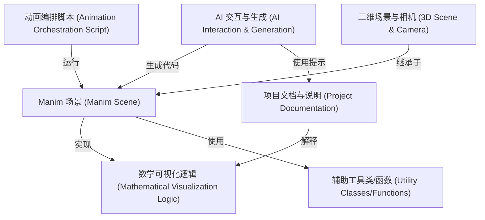

# Tutorial: Math-To-Manim

该项目使用 **Manim** 动画引擎，借助 *AI*（如 DeepSeek）将复杂的**数学和物理概念**（例如量子电动力学、期权偏度）转化为**可视化动画**。
你可以把它看作一个工具，输入数学描述（通常是详细的 LaTeX），输出相应的 Python 动画代码。项目包含各种示例、辅助工具函数以及 AI 交互界面。

**Source Repository:** [https://github.com/HarleyCoops/Math-To-Manim.git](https://github.com/HarleyCoops/Math-To-Manim.git)

## Chapters

1. [数学可视化逻辑 (Mathematical Visualization Logic)
](01_数学可视化逻辑__mathematical_visualization_logic__.md)
2. [AI 交互与生成 (AI Interaction & Generation)
](02_ai_交互与生成__ai_interaction___generation__.md)
3. [Manim 场景 (Manim Scene)
](03_manim_场景__manim_scene__.md)
4. [三维场景与相机 (3D Scene & Camera)
](04_三维场景与相机__3d_scene___camera__.md)
5. [动画编排脚本 (Animation Orchestration Script)
](05_动画编排脚本__animation_orchestration_script__.md)
6. [项目文档与说明 (Project Documentation)
](06_项目文档与说明__project_documentation__.md)
7. [辅助工具类/函数 (Utility Classes/Functions)
](07_辅助工具类_函数__utility_classes_functions__.md)

---

