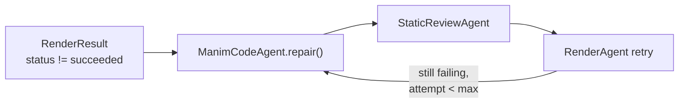

# Codex 与 OpenAI Agents SDK 重构架构

M2M2 把简短数学 prompt 转成经过验证的教育动画产物。重构保留公开 Math-To-Manim 中 reverse knowledge tree 的思想，但让每个阶段都显式、可测试，并且不绑定特定 provider。

## 目标

- 保留 prompt-to-Manim 工作流，同时用类型化 stage contracts 替代临时 agent scripts。
- 在生成 code 之前输出中间 artifacts，让 LLM 输出可审阅。
- 让失败局部化：糟糕的 visual plan 不应要求重跑 concept discovery；糟糕的 render 也不应要求重跑 planning。
- 通过稳定 file ownership 和 artifact handoff points，支持 Codex workers 并行工作。

## 运行形态

执行是**单线程且严格有序**的：`math_to_manim/pipeline/runner.py` 中的 `AnimationPipeline.generate()` 会走过固定 stage agents 列表。没有隐藏并行；下方图中的每条箭头都是一次同步调用，其输出会成为下一阶段的输入类型。

**写入内容：** runner 先保存 `request.json`，随后几乎每个 stage 都会在新的 `runs/<timestamp>-<slug>/` 目录下添加一个同级 JSON 文件（`intent.json`、`knowledge_graph.json` 等）。`trace.jsonl` 以 structured events 记录相同的阶段边界，`manifest.json` 总结该次运行的 artifact keys。这就是“typed pipeline”的具体含义：磁盘布局镜像控制流。

**LLM vs deterministic：** 当 `RuntimeConfig.deterministic` 为 false（默认）时，planning stages 调用 `run_structured_sdk_agent()` 并返回 Pydantic artifacts。Deterministic 模式下，stages 回退到脚手架 graphs 或 templates，让 CI 和 offline runs 可复现。Code generation 使用 Agents SDK、`CodexCliProvider`，或一个极小 deterministic Manim stub；见 `ManimCodeAgent`。Rendering 和 static validation 由工具支持（Python AST、subprocess Manim）。

**Docs 中的 Mermaid：** GitHub 会渲染 Markdown 中 fenced `mermaid` blocks。把同一份 source 粘到 [mermaid.live](https://mermaid.live) 可以得到可编辑画布，并可导出 PNG 或 SVG；它和 mermaid.ink 一类服务精神相近，但不需要把渲染后的 bitmap 放进 git。

### 主图表达什么

这张图是 **artifact chain**，不是 agents 聊天的社交图。每个框命名 Python stage class；节点第二行是主要 JSON 文件，用于可检查性和 reruns。

```mermaid
flowchart TB
  subgraph planning["Planning — intent through scene spec"]
    REQ["UserRequest"]
    IA["IntentAgent"]
    CI["ConceptIntent\n(intent.json)"]
    PGA["PrerequisiteGraphAgent"]
    KG["KnowledgeGraph\n(knowledge_graph.json)"]
    CA["CurriculumAgent"]
    CUR["CurriculumPlan\n(curriculum.json)"]
    MA["MathAgent"]
    MP["MathPacket\n(math_packet.json)"]
    SA["StoryboardAgent"]
    SB["VisualStoryboard\n(storyboard.json)"]
    SSA["SceneSpecAgent"]
    SPEC["ManimSceneSpec\n(scene_spec.json)"]

    REQ --> IA --> CI --> PGA --> KG --> CA --> CUR --> MA --> MP --> SA --> SB --> SSA --> SPEC
  end

  subgraph codegen["Code — generation and static gate"]
    MCA["ManimCodeAgent"]
    GC["GeneratedCode\n(generated_code.json)"]
    PY["generated_scene.py"]
    SRA["StaticReviewAgent"]
    VAL["ValidationReport\n(validation_report.json)"]

    SPEC --> MCA --> GC --> PY --> SRA --> VAL
  end

  subgraph render_pkg["Render — subprocess Manim + packaging"]
    RA["RenderAgent"]
    RR["RenderResult\n(render_result.json)"]
    VRA["VideoReviewAgent"]
    REV["VideoReviewReport\n(review_report.json)"]
    PA["PublisherAgent"]
    PKG["AnimationPackage\n(animation_package.json)"]

    VAL --> RA --> RR --> VRA --> REV --> PA --> PKG
  end
```

只有在请求渲染并且静态验证成功时才会运行 rendering；否则 `RenderAgent.run` 不会被调用，runner 会合成一个 skipped `RenderResult`，让下游 stage 仍然收到相同 schema shape。这个 skipped record 会在 stderr 中说明跳过是有意的（`--no-render`）还是因为 validation failure。

### Render repair loop（Manim 失败时）

失败渲染可以触发有界修复循环，而**不需要**重新计算更早的 planning artifacts。`ManimCodeAgent.repair()` 消费同一个冻结的 `ManimSceneSpec` 加 stderr 或 stdout；retry 前 static validation 必须再次通过。尝试次数由 `RuntimeConfig.max_render_repairs` 限制。

当 `codegen_provider=codex-cli` 时，repair 会在同一路径上调用 `CodexCliProvider.repair_code`。

### 映射到经典 Math-To-Manim 名称

公开仓库用 pedagogy 命名 stage（ConceptAnalyzer、PrerequisiteExplorer 等）。M2M2 保留这个**思想**，但把一些叙事步骤折叠进单个 typed artifacts，让链条更短、更可测试。

| Legacy mental model | M2M2 stage(s) | Artifact |
| --- | --- | --- |
| Concept / goal framing | `IntentAgent` | `intent.json` |
| Reverse knowledge tree | `PrerequisiteGraphAgent` | `knowledge_graph.json` |
| Teachable ordering | `CurriculumAgent` | `curriculum.json` |
| Equations and definitions | `MathAgent` | `math_packet.json` |
| Visual plus narrative design | `StoryboardAgent` | `storyboard.json` |
| Compiler-like scene contract | `SceneSpecAgent` | `scene_spec.json` |
| Code generation and repair | `ManimCodeAgent` | `generated_code.json`, `generated_scene.py` |
| Syntax and scene class checks | `StaticReviewAgent` | `validation_report.json` |
| FFmpeg or Manim subprocess | `RenderAgent` | `render_result.json` |
| Draft review handoff | `VideoReviewAgent` | `review_report.json` |
| Final bundle metadata | `PublisherAgent` | `animation_package.json` |

## Agent roles（实现）

今天的 orchestration 是 pipeline runner，而不是每个 stage 之间都用嵌套 SDK handoffs。单个 stage 仍会在配置允许时使用 Agents SDK（structured outputs）或 Codex CLI；tools 负责 AST checks、filesystem writes、Manim 和 video probing。

| Stage class | Typical mechanism | Primary output schema |
| --- | --- | --- |
| `IntentAgent` | Agents SDK structured call 或 deterministic scaffold | `ConceptIntent` in `intent.json` |
| `PrerequisiteGraphAgent` | Agents SDK | `KnowledgeGraph` |
| `CurriculumAgent` | Agents SDK 或 graph 的 topological fallback | `CurriculumPlan` |
| `MathAgent` | Agents SDK | `MathPacket` |
| `StoryboardAgent` | Agents SDK | `VisualStoryboard` |
| `SceneSpecAgent` | Agents SDK | `ManimSceneSpec` |
| `ManimCodeAgent` | Agents SDK、Codex CLI provider 或 deterministic code | `GeneratedCode` |
| `StaticReviewAgent` | AST 和 scene discovery tools | `ValidationReport` |
| `RenderAgent` | Subprocess Manim | `RenderResult` |
| `VideoReviewAgent` | Probe 和 scoring helpers | `VideoReviewReport` |
| `PublisherAgent` | Pure assembly | `AnimationPackage` |

当 specialist 需要接管一次 structured call 时，在 stage 内使用 SDK handoffs。对 schema validation、filesystem I/O、Manim invocation 和 artifact packaging 这类 deterministic steps 使用 function tools。在 first input、final output 和 tool boundary 上使用 guardrails，因为 malformed code 或 unsafe file access 会造成下游失败。

## Codex Worker 边界

Codex 是开发和维护 worker，不是必需运行时依赖。Workers 应通过 files 和 docs 沟通，而不是共享内存。

- Package/runtime workers 负责 application code 和 tests。
- Docs/evals workers 负责 `docs/**`、`evals/**`、`examples/reference/**` 和不重叠的 `scripts/**`。
- Generated media 应留在 source control 外，除非后续 owner 定义 golden-artifact policy。

## Provider Policy

重构不应在 artifact schemas 内编码 Anthropic、Gemini、Kimi 或 OpenAI 假设。Provider-specific clients 应藏在 stage runners 后面。同一个 `scene_spec` 应能被任何兼容 Manim code generator 接受。

对 OpenAI implementations，优先使用 OpenAI 文档中的 Agents SDK primitives：agents、tools、handoffs、guardrails、sessions 和 tracing。Tracing 特别有用，因为它会记录一次 run 中的 model generations、tool calls、handoffs 和 guardrail activity。

## Failure Handling

- Schema failure：停止 stage，返回 validation report，并保留最后一个有效 upstream artifact。
- Code syntax failure：只从同一个 `scene_spec` 修复 generated Manim file。
- Render failure：记录 command、stderr summary、environment 和 scene class。
- Eval failure：保留 artifacts 并标记 run 不可 shipping；不要删除调试需要的 evidence。

## Source Links

- Public baseline: https://github.com/HarleyCoops/Math-To-Manim
- Codex docs: https://platform.openai.com/docs/codex
- Agents SDK docs: https://openai.github.io/openai-agents-python/
- Agents SDK tracing: https://openai.github.io/openai-agents-python/tracing/
